# Plumbot Flow Map

<!-- GENERATED by docs/flow/build_flow_map.py from docs/flow/flow_spec.py and the code.
     Do not edit by hand: edit flow_spec.py (the pre-commit hook rebuilds this file). -->

Plumbot as one system, at three levels of detail. Start at the top and go down only as far as the question you are answering needs.

1. **[The lead's journey](#1-the-leads-journey)**: the stages a lead moves through, and what the bot does at each. The level for business decisions.
2. **[The reply ladder](#2-the-reply-ladder)**: the order the bot checks things in when a message arrives. The first rung that matches answers; everything below it never runs.
3. **[The full map](#3-the-full-map)**: every step, decision and message, section by section.

**The interactive version** (click any step for the exact wording, its code and its neighbours) is at `/platform/flow-map/` on the dashboard for superusers, built from the deployed code. Locally: `python docs/flow/build_flow_map.py`, then open `docs/flow/plumbot-flow.html`.

**15 stages · 65 ladder rungs · 266 steps · 301 links · 500 customer lines**, all read from the code on every build.

## 1. The lead's journey

The main path runs left to right. The stages underneath are where a lead goes when they step off it, and where they come back from.

```mermaid
flowchart LR
  j_first(["First message"])
  class j_first main
  j_job(["Describing the job"])
  class j_job main
  j_area(["Area and proof"])
  class j_area main
  j_price(["Talking price"])
  class j_price main
  j_offer(["Visit offered"])
  class j_offer main
  j_booked(["Booked"])
  class j_booked main
  j_visited(["Visit done"])
  class j_visited main
  j_quoted(["Quote sent"])
  class j_quoted main
  j_won(["Job won"])
  class j_won main
  j_delay["Not ready yet"]
  class j_delay side
  j_online["Online quote"]
  class j_online side
  j_plan["Sent a plan"]
  class j_plan side
  j_quiet["Gone quiet"]
  class j_quiet side
  j_stop["Stopped or out of area"]
  class j_stop side
  j_cold["Cold"]
  class j_cold side
  j_first -->|"they say what needs doing"| j_job
  j_job -->|"job known"| j_area
  j_area -->|"asks a price"| j_price
  j_area -->|"area known"| j_offer
  j_area -.->|"out of area"| j_stop
  j_price -->|"a quick look"| j_offer
  j_price -.->|"quote online"| j_online
  j_offer -->|"picks a slot"| j_booked
  j_offer -.->|"not now"| j_delay
  j_offer -.->|"hesitates"| j_online
  j_booked -->|"visit happens"| j_visited
  j_visited -->|"quote raised"| j_quoted
  j_quoted -->|"accepted"| j_won
  j_quoted -.->|"no answer"| j_cold
  j_delay -.->|"the date comes"| j_offer
  j_delay -.->|"wants a quote first"| j_online
  j_online -.->|"plumber quotes"| j_quoted
  j_plan -.->|"quote sent"| j_quoted
  j_quiet -.->|"they reply"| j_job
  classDef main fill:#c9e6ff,stroke:#006591,color:#0b1c30
  classDef side fill:#eff4ff,stroke:#6e7881,stroke-dasharray:4 3,color:#0b1c30
```

| Stage | How we know a lead is here | What the bot does |
|---|---|---|
| **First message** A new chat opens, usually from a Facebook ad. | A new lead row; the CTWA ad referral when it came from an ad. | WhatsApp webhook event arrives, WAMID seen before?, Find or create the lead, log the user turn, The owner's opener, Voice note: ask them to type it, Contact card, or answer to our card question?, Media ack: what we saw, then the next question |
| **Describing the job** We learn what needs doing and how many rooms. | Service type and project description empty or being filled. | The owner's opener, Waiting on "is X the only thing?", Ask what else to sort while we are there, Scope captured: advance to booking, "No" to our request for detail?, "No" to the new-build confirmation?, A new build described?, FAQ topic (or an AI-routed service question)? (+2 more) |
| **Area and proof** We ask where they are and show two or three jobs like theirs. | Customer area empty; previous-work photos not yet sent. | Area in this message?, Excluded city?, Photo or plan ask before the area question (once), Lead's words outrank the proof step?, Proof step: 2 or 3 matched past jobs, then the next question, The whole previous-work gallery, First ask: the exact approved script |
| **Talking price** They ask what it costs. Can happen at any stage. | A price question; sent_pricing_intents; [PRICE_CHOICE_PENDING]. | Price question, and service, description and area known?, Prices, then the price-guide PDF, then "a look or online?", Answer to "quick look or quote online first?", Online: the plumber, his WhatsApp link, their details typed in, Price asked on a highlighted photo of ours?, Job quote: we price it at a quick look, Service price block, then the invest tie-down, Combined approximate prices, supply and labour split (+6 more) |
| **Visit offered** We offer two real slots for a quick look at the space. | Next question is the date or time; the availability ask sent. | Availability ask: two real slots, Visit price stated once, with the availability ask, "No" or "neither" to our day or time?, "No" to the lock-in close?, At the date stage, pivots to a timeline?, Controller reply: visit close, fee objection or pleasantry, Slot not available: alternatives, Picking one of the alternative times we listed? (+1 more) |
| **Booked** The visit is in the diary; we ask their name. | Status confirmed with a scheduled date and time. | Book: status confirmed, diary, calendar, Booking confirmation (queued, deterministic), Team and plumber told of the booking, Ask the name for the booking, A confirmed lead asking to reschedule?, Confirmed and complete?, Reminders cron (every 5 min): send_reminders, Customer reminders: booking, morning, 2 hours, 30 minutes (+1 more) |
| **Visit done** The plumber has been; the debrief form goes out. | The visit time has passed; a site-visit report exists. | send_post_visit_followups (Email_Follow_Ups), A visit that ended and needs its report?, Plumber emailed the debrief form (35 min after), Plumber fills the site-visit form |
| **Quote sent** The quote is out and the follow-up sequence runs. | A quotation marked sent; the quote sequence started. | Build the quote (editor, templates), Quote sent: email PDF or WhatsApp handoff, Quote follow-up sequence to the lead, Phone quote: plumber fills a one-tap form |
| **Job won** The job is scheduled and reminded. | A job scheduled against the lead. | Schedule a job, update its status, Job reminders |
| **Not ready yet** They defer. We get a timeframe, then an email for the portfolio. | [DELAY_SIGNAL]; [OOS_PENDING] delay_*; a check-back date. | Out-of-scope / delay / complaint handler, Delay subtype?, Brush-off: no pressure, roughly when?, Comparison shopping: past jobs plus a like-for-like tip, Other delay: the slow-lead timeframe ask, Timeframe answer: no date, near or far?, Near, "I will contact you": we wait, Near, "contact me on Monday": ask the email (+9 more) |
| **Online quote** Handed to the plumber on WhatsApp to quote from photos or a plan. | The plumber link sent ([HESITATION_ONLINE_OFFERED] or the link tag). | Online: the plumber, his WhatsApp link, their details typed in, No pressure on the visit: free online quote first, Asks about the plumber link?, What the link is, then the contact card, The plumber handoff: link and number at the bottom, Send the plumber handoff |
| **Sent a plan** A drawing arrives, so the quote comes off the plan, no visit. | plan_status set; a PlanQuoteRequest open. | Is it their own plan or drawing?, Lead goes on the plan path (plan_status), Plan upload flow?, "I will send the plan later"?, PlanQuoteRequest opened, send_plan_quote_followups (Email_Follow_Ups), Plumber emailed the job and the plan, Plumber taps "I have sent the quote" (+1 more) |
| **Gone quiet** No reply. Up to four touches, or two with the plumber handoff. | The last turn is ours; follow-up count and touches since their reply. | Follow_Ups cron (every 7 min): send_followups, Eligible? not paused, stopped, synthetic; 4-touch cap; 4h floor, A handoff lead? (delay signal, or all three fields), Contextual follow-up written by DeepSeek, Fallback: the owner's April 2026 scripts, The plumber handoff: link and number at the bottom, Nudge parked leads, Unanswered sweep: reply to any message left unanswered |
| **Stopped or out of area** They asked us to stop, or we cannot travel there. | [STOP_REQUESTED]; an excluded city; [FOLLOWUPS_OFF]. | Hard stop ("stop messaging me")?, Hard-stop acknowledgement, Excluded area?, Out-of-area decline, Out of scope: reframe to plumbing or redirect, Mark inactive / stop follow-ups |
| **Cold** The quote sequence ended without an answer. | The quote marked cold; the lead handed back to staff. | No answer: marked cold, handed back, Mark inactive / stop follow-ups, Send a manual WhatsApp or follow-up |

## 2. The reply ladder

Read top to bottom. Each rung is checked in this order, in the order the code runs it (the order is read from the code, so it cannot drift). The first rung that matches sends its reply and the turn ends. Moving a rung up means it wins over everything it passes.

### Every inbound message

The reply router. Runs on every batched turn. (`_generate_and_schedule_reply` in `bot/whatsapp_webhook.py`)

| # | When | Then | Kind |
|---|---|---|---|
| 1 | **Bot paused for this lead?** | paused: No reply (staff has the chat) | If (code) |
| 2 | **Booked lead sent a bare thanks?** e.g. "Thanks!  (after booking)" | yes: No reply (staff has the chat) | If (code) |
| 3 | **Hard stop ("stop messaging me")?** e.g. "please stop messaging me" | stop: Hard-stop acknowledgement "Got it, loud and clear. I'll back off completely. If you change your mind, just say Hey and I'll be here." | Override gate |
| 4 | **Capture any email address in the message** e.g. "my email is jane@example.com" | carries on | State |
| 5 | **Contact card, or answer to our card question?** e.g. "[contact card] call my husband about it" | yes: Contact card reply "Thanks, we'll give {name} a call." | If (code) |
| 6 | **Unified DeepSeek turn: intent, product, fields, next move** | carries on | Model writes |
| 7 | **Controller shadow log** | carries on | Step |
| 8 | **Controller move?** | carries on | If (model) |
| 9 | **Remember the English rendering (rules only)** | carries on | Step |
| 10 | **Area in this message?** e.g. "Bluffhill" | area given: Excluded city? | If (code) |
| 11 | **Lead's words outrank the proof step?** | show_work stands: Proof step: 2 or 3 matched past jobs, then the next question "Here is one we just finished." other move: Controller reply: visit close, fee objection or pleasantry "The best way to give you an exact price is a quick visit. We measure up and you get a fixed price, no surpr..." | Override gate |
| 12 | **Waiting on "is X the only thing?"** e.g. "also a toilet" | carries on | If (code) |
| 13 | **A delay signal outranks the scope question** | plain no: Ask what else to sort while we are there "No problem — what else would you like sorted while we're there?" named more / answered: Scope captured: advance to booking "One last thing, what name should we put on the booking? If you'd rather not share it, just say no." | Override gate |
| 14 | **"Nothing else" after our value check?** e.g. "no that's all" | yes: Scope captured: advance to booking "One last thing, what name should we put on the booking? If you'd rather not share it, just say no." | If (code) |
| 15 | **"No" to our request for detail?** e.g. "no  (to "can you tell me a bit more?")" | yes: Stop asking for detail, move on | If (code) |
| 16 | **"No" to the lock-in close?** e.g. "no  (to "Want me to lock in a time?")" | yes: Price or timing? one question, two options "No problem at all. Is it the timing that's off, or the call-out fee?" | If (code) |
| 17 | **"No" or "neither" to our day or time?** e.g. "neither works" | yes: Open the question up (never the same two slots) "No problem. What day would suit you better?" | If (code) |
| 18 | **"No" to the new-build confirmation?** e.g. "no, it's a renovation" | yes: Clear the wrong guess, ask what the job is "Ah, my mistake. What's the plumbing side you're looking to get sorted?" | If (code) |
| 19 | **At the date stage, pivots to a timeline?** e.g. "only next month" | yes: Timeline reply: park far, keep booking near "No rush at all. {when} is a way out yet, so I'll make a note and we'll reach out closer to the time to lock..." | If (model) |
| 20 | **Price asked on their materials list?** e.g. "how much for everything on the list?" | yes: Materials list priced from the tenant's own quote lines "These are the prices I have for now on your list:" | If (code) |
| 21 | **FAQ topic (or an AI-routed service question)?** e.g. "where are you located?" | first time: First ask: the exact FAQ fact plus a tie-down "Ehe, tinoita {it} pamwe nemamwe mabasa epaipi ese akabatana nazvo. {it} chete here chamuri kuda kugadzirisa?" | If (code) |
| 22 | **"Send it here" again, PDF already sent?** e.g. "just send it here" | yes: It is the PDF just above "It's the PDF we sent just above in this chat, so it's there whenever you're ready to open it. If it didn't..." | If (code) |
| 23 | **Asks about the plumber link?** e.g. "what is this link? is it a scam?" | yes: What the link is, then the contact card "Fair question. That link just opens a WhatsApp chat with {who}, who handles our quotes, with your job detai..." | If (code) |
| 24 | **Hesitating over the visit, or pushing for an exact figure?** e.g. "can't you just quote?" | yes: No pressure on the visit: free online quote first "No pressure at all on the visit." | If (code) |
| 25 | **Answer to "quick look or quote online first?"** e.g. "online first please" | online: Online: the plumber, his WhatsApp link, their details typed in "{who} handles our quotes and can give you a free online quote without coming out. Send measurements, a few..." a look: Availability ask: two real slots (Qualification and booking) "Great, would {slots[0]} work for us to come through and {purpose}?" | If (code) |
| 26 | **Two or more info questions in one message?** e.g. "where are you based and how much?" | yes: One reply answering every question "Sending photos of our previous work now" | If (code) |
| 27 | **Asks for pictures of our work?** e.g. "can I see your work?" | yes: The whole previous-work gallery "What exactly are you looking to get done?" | If (code) |
| 28 | **Points at one portfolio piece?** e.g. "the black bathtub one" | yes: That piece with its caption | If (code) |
| 29 | **"What can you show me?"** e.g. "what can you show me?" | yes: Text menu of pieces "Here are some of the pieces I can send you:" | If (code) |
| 30 | **Products AND prices?** e.g. "send your products and prices" | yes: Catalogue images plus the price list "Here's our product catalogue. The plumber gives a fixed quote on the spot after seeing the space, and the s..." | If (code) |
| 31 | **Photo request (explicit, or the classifier)?** e.g. "can I have a pic" | yes: Work photos, with any definition asked alongside "{_definition} Here are some examples of our previous work so you can see it fitted." | If (model) |
| 32 | **Answering our price tie-down or budget ask?** e.g. "not really  (to the invest tie-down)" | no to tie-down: How much were you hoping to invest? "Hapana dambudziko. {self._BUDGET_ASK['shona'][0]}?" gave a figure: Our options at or under their figure "Thanks, that helps. With {money} in mind, {...}: {lines} Would {...} work for you, or should we come and ha..." | If (code) |
| 33 | **Out-of-scope / delay / complaint handler** e.g. "I'm travelling, will get back to you" | Someone selling TO us? | Step |
| 34 | **Price asked on a highlighted photo of ours?** e.g. "this one how much?  (replying to our photo)" | three fields known: Prices, then the price-guide PDF, then "a look or online?" "Here's our price guide, with past jobs and our starting prices." photo has a price: That photo's own price lines | If (code) |
| 35 | **Price question, and service, description and area known?** e.g. "how much for all of it?" | yes: Prices, then the price-guide PDF, then "a look or online?" "Here's our price guide, with past jobs and our starting prices." | If (code) |
| 36 | **Describing the project, carried-over intent, or mid-chat with no price ask?** e.g. "I want my whole bathroom redone" | carries on | Override gate |
| 37 | **Quote for a whole job, no product named?** e.g. "May I get a quote for a four bedroomed house" | yes: Job quote: we price it at a quick look "We'll price it off the plan you sent and get the quote to you." | If (code) |
| 38 | **Pricing objection wording?** e.g. "that's expensive" | yes: Full pricing overview (or a recap once sent) "Detect the language of this message. Reply with ONLY 'shona', 'english', or 'mixed'." | If (code) |
| 39 | **Asking something we already answered?** e.g. "how much did you say it was?" | carries on | If (model) |
| 40 | **A new build described?** e.g. "I want to build a new house" | yes: Confirm the new build back "So you need a new plumbing installation for a new {subject}?" | If (code) |
| 41 | **generate_response (STEP 4)** e.g. "Tuesday 10am" | Post-booking email capture pending? | Step |
| 42 | **finalise_outbound(reply)** | A scripted reply that repeats a recent message? | Trigger |

### Inside rung "generate_response" (qualification and booking)

What the last rung of the router runs, in its own order. (`ResponseMixin.generate_response` in `bot/views/plumbot/response_mixin.py`)

| # | When | Then | Kind |
|---|---|---|---|
| 1 | **Post-booking email capture pending?** e.g. "jane@example.com  (after we asked)" | carries on | If (code) |
| 2 | **Delay signal active?** e.g. "maybe next month" | carries on | If (code) |
| 3 | **First-time delay or exit signal?** e.g. "I'll let you know" | carries on | If (code) |
| 4 | **A direct question first?** e.g. "do you do geysers?" | carries on | If (code) |
| 5 | **A no to our budget tie-down?** e.g. "no  (to the invest tie-down)" | carries on | If (code) |
| 6 | **Asking for a materials list?** e.g. "can you send a materials list?" | carries on | If (code) |
| 7 | **Bare "ok" at the service-type stage?** e.g. "ok" | carries on | If (code) |
| 8 | **Out of scope, delay or complaint (second net)?** | yes: Out-of-scope / delay / complaint handler (Delay, exit and complaint) | If (code) |
| 9 | **A size or spec question?** e.g. "how big are your tubs?" | carries on | If (code) |
| 10 | **Catalogue or product list?** e.g. "what products do you have?" | carries on | If (code) |
| 11 | **Product pricing, before booking?** e.g. "how much is a vanity?" | carries on | If (code) |
| 12 | **Plan upload flow?** e.g. "[a PDF plan]" | plan path: PlanQuoteRequest opened (Visit, quote and plan path) | If (code) |
| 13 | **Plan lead, timeline beyond the week?** | carries on | If (code) |
| 14 | **Confirmed and complete?** e.g. "what should I prepare?  (booked lead)" | carries on | If (code) |
| 15 | **Picking one of the alternative times we listed?** e.g. "the second one" | carries on | If (code) |
| 16 | **Extract everything in the message** e.g. "Borrowdale, Friday morning" | carries on | Model writes |
| 17 | **"I will send the plan later"?** e.g. "I'll send the plan later" | carries on | If (code) |
| 18 | **Update the appointment with what was extracted** | carries on | State |
| 19 | **Excluded area?** e.g. "I'm in Bulawayo" | yes: Out-of-area decline "Ah, sorry. {_city} is a bit far for our team to travel to, so we can't take this one on properly. If you've..." | If (code) |
| 20 | **A confirmed lead asking to reschedule?** e.g. "can we move it to Thursday?" | yes: Reschedule reply "Done — I've moved you to {when}. Someone will call you before we head over. If anything else changes, just..." | If (code) |
| 21 | **Garage or outbuilding scope question?** e.g. "is the garage included?" | carries on | If (code) |
| 22 | **Ready to book? every field in, slot valid** e.g. "Friday 9am works" | slot not free: Slot not available: alternatives "Could you suggest a different day and time?" | If (code) |
| 23 | **Several prices / a commitment / an FB price / a flow answer / a quote / a standalone question?** | standalone question: Answer the standalone question, then a soft nudge "work for a free site visit?" several prices: Combined approximate prices, supply and labour split (Pricing) "Starting prices (supply and install):" a quote: Job quote: we price it at a quick look (Pricing) "We'll price it off the plan you sent and get the quote to you." | If (code) |

## 3. The full map

| Shape | Kind | Meaning |
|---|---|---|
| Stadium | **Trigger** | Something starts a flow: an inbound message, a cron tick, a staff click. |
| Rectangle | **Step** | Code does something deterministic. |
| Diamond | **If (code)** | A deterministic if: keywords, stored state, dates, regexes. |
| Hexagon | **If (model)** | A branch decided by the DeepSeek classification or the controller. |
| Inverted trapezoid | **Override gate** | A guard that outranks the flow: the customer's own words, a hard stop, a duplicate. |
| Parallelogram | **WhatsApp message** | A message the customer receives on WhatsApp. Click for the exact wording. |
| Reversed parallelogram | **Email / PDF** | An email or document sent to the customer or the plumber. |
| Subroutine | **Model writes** | A DeepSeek call that writes or reads text (fenced, with a fallback). |
| Cylinder | **State** | Something stored on the lead: a field, a notes tag, a row. |
| Trapezoid | **Staff action** | A person does this on the dashboard (or the plumber on a form). |
| Flag | **Internal alert** | A message to the plumber or the team, never customer copy. |
| Circle | **Loop / cron job** | Runs repeatedly: a cron pass over leads, a retry ladder. |
| Rounded | **Wait** | A deliberate delay: the debounce batch, the human reply delay. |
| Double circle | **End** | The turn ends here, usually in silence. |

Edges: solid = the flow, dotted = the "no" / fall-through branch, thick = a loop back or a hand-off to another section.

- [Inbound message](#inbound-message): A WhatsApp event arrives: tenant, WAMID dedup, message type, logging, delay marking, the debounce batch.
- [Router preamble](#router-preamble): The start of every reply turn: pause, hard stop, contact cards, the unified DeepSeek turn, area capture, the proof step and controller moves.
- [Answers to our last question](#answers-to-our-last-question): Pending states read before anything else: scope confirm, the no-handlers, the timeline pivot, the materials list and the FAQ layer.
- [Requests and objections](#requests-and-objections): Router STEP 0-a to 1a: link questions, hesitation, the price-guide choice, multi-intent, pictures and catalogue, the budget ladder.
- [Delay, exit and complaint](#delay-exit-and-complaint): Router STEP 1b and the out-of-scope handler: timeframe, near or far, the job-date ladder, email and portfolio, complaints.
- [Pricing](#pricing): Router STEP 1c to 3c: a highlighted photo, the price guide, product prices, quotes lean to the visit, the overview, repeats, new builds.
- [Qualification and booking](#qualification-and-booking): Router STEP 4, generate_response: extraction, the question order, the scripted first ask, retries, booking and the name ask.
- [Outbound chain](#outbound-chain): finalise_outbound, which every reply passes: the model reader, the strippers, speak as WE, no dashes, one question; then the delayed send.
- [Follow-ups and crons](#follow-ups-and-crons): The Railway crons: follow-ups with the 4-touch cap and the handoff, delay nudges, the job-date ladder, reminders, email, the unanswered sweep.
- [Visit, quote and plan path](#visit-quote-and-plan-path): After the visit: the debrief form, quotes and their follow-up sequence; the plan path; future-dated visit proposals; phone quotes.
- [Dashboard operations](#dashboard-operations): What staff do on the dashboard and how each action feeds the automated flow.
- [Platform and billing](#platform-and-billing): The operator side: tenants, their config and lead magnet, client intake, invoices, payments and billing reminders.

### Inbound message

A WhatsApp event arrives: tenant, WAMID dedup, message type, logging, delay marking, the debounce batch.

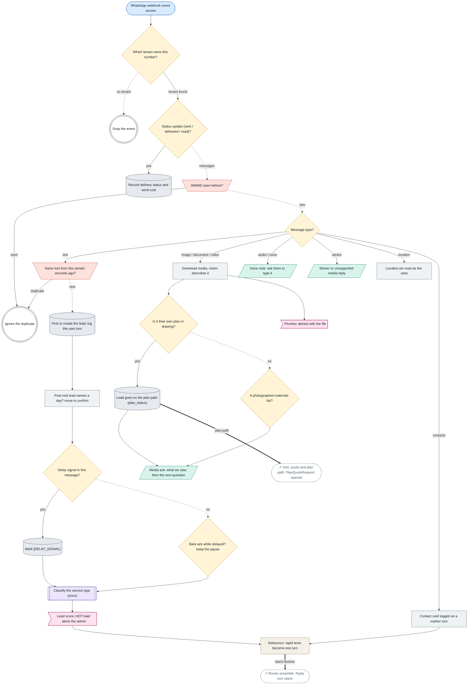

| Step | Kind | Where in the code | Wording |
|---|---|---|---|
| **WhatsApp webhook event arrives** `in_webhook` | Trigger | [`whatsapp_webhook.py`](../../bot/whatsapp_webhook.py) `handle_webhook_event` [`whatsapp_webhook.py`](../../bot/whatsapp_webhook.py) `process_webhook_in_background` | - |
| **Which tenant owns this number?** `in_tenant` | If (code) | [`whatsapp_webhook.py`](../../bot/whatsapp_webhook.py) `_resolve_tenant_for_value` | - |
| **Drop the event** `in_drop` | End | - | - |
| **Status update (sent / delivered / read)?** `in_status` | If (code) | [`whatsapp_webhook.py`](../../bot/whatsapp_webhook.py) `process_message_change` at "HANDLE STATUSES FIRST" | - |
| **Record delivery status and send cost** `in_status_rec` | State | [`whatsapp_webhook.py`](../../bot/whatsapp_webhook.py) `process_status_updates` [`whatsapp_webhook.py`](../../bot/whatsapp_webhook.py) `_record_send_cost` | - |
| **WAMID seen before?** `in_wamid` | Override gate | [`whatsapp_webhook.py`](../../bot/whatsapp_webhook.py) `process_message_change` at "if message_id:" | - |
| **Ignore the duplicate** `in_dup` | End | - | - |
| **Message type?** `in_type` | If (code) | [`whatsapp_webhook.py`](../../bot/whatsapp_webhook.py) `process_message_change` at "if message_type == 'text':" | - |
| **Voice note: ask them to type it** `in_audio` | WhatsApp message | [`whatsapp_webhook.py`](../../bot/whatsapp_webhook.py) `handle_audio_message` [`whatsapp_webhook.py`](../../bot/whatsapp_webhook.py) `_voice_note_topic` | `VOICE_NOTE_ASK`, `VOICE_NOTE_CONTEXT`, `VOICE_NOTE_ASKED` |
| **Sticker or unsupported media reply** `in_sticker` | WhatsApp message | [`whatsapp_webhook.py`](../../bot/whatsapp_webhook.py) `handle_unsupported_media` | 1 line(s) in `handle_unsupported_media` |
| **Location pin read as the area** `in_location` | Step | [`whatsapp_webhook.py`](../../bot/whatsapp_webhook.py) `handle_location_message` | - |
| **Contact card logged as a marker turn** `in_contacts` | Step | [`whatsapp_webhook.py`](../../bot/whatsapp_webhook.py) `handle_contacts_message` [`shared_contact.py`](../../bot/shared_contact.py) `marker_text` | - |
| **Download media, vision describes it** `in_media` | Step | [`whatsapp_webhook.py`](../../bot/whatsapp_webhook.py) `handle_media_message` | - |
| **Is it their own plan or drawing?** `in_is_plan` | If (code) | [`whatsapp_webhook.py`](../../bot/whatsapp_webhook.py) `handle_media_message` at "_verified_plan = False" [`plan_detection.py`](../../bot/plan_detection.py) `is_their_own_plan` [`whatsapp_webhook.py`](../../bot/whatsapp_webhook.py) `_description_is_a_plan` | - |
| **Lead goes on the plan path (plan_status)** `in_plan` | State | [`whatsapp_webhook.py`](../../bot/whatsapp_webhook.py) `handle_media_message` at "A plan on file puts the lead on the PLAN path" | - |
| **A photographed materials list?** `in_list` | If (code) | [`vision.py`](../../bot/services/vision.py) `transcribe_materials_list` [`materials_list.py`](../../bot/materials_list.py) `looks_like_materials_list` | - |
| **Media ack: what we saw, then the next question** `in_media_ack` | WhatsApp message | [`whatsapp_webhook.py`](../../bot/whatsapp_webhook.py) `_compose_media_ack` [`whatsapp_webhook.py`](../../bot/whatsapp_webhook.py) `_media_ack_reply` [`whatsapp_webhook.py`](../../bot/whatsapp_webhook.py) `_schedule_media_ack` [`photo_ask.py`](../../bot/photo_ask.py) `seen_line` | 6 line(s) in `_compose_media_ack`, 2 line(s) in `_MEDIA_ACK_QUESTIONS`, 1 line(s) in `_PLAN_DESCRIPTION_ASK`, 2 line(s) in `_materials_list_question`, 1 line(s) in `seen_line`, 2 line(s) in `list_seen_line` |
| **Plumber alerted with the file** `in_media_alert` | Internal alert | [`whatsapp_webhook.py`](../../bot/whatsapp_webhook.py) `_schedule_plumber_alert` | - |
| **Same text from this sender seconds ago?** `in_text` | Override gate | [`whatsapp_webhook.py`](../../bot/whatsapp_webhook.py) `_is_duplicate_text_event` | - |
| **Find or create the lead, log the user turn** `in_log` | State | [`whatsapp_webhook.py`](../../bot/whatsapp_webhook.py) `handle_text_message` at "get_or_create_lead" | - |
| **Post-visit lead names a day? move to confirm** `in_postvisit` | Step | [`post_visit.py`](../../bot/post_visit.py) `note_inbound_reply` | - |
| **Delay signal in this message?** `in_delay` | If (code) | [`out_of_scope_handler.py`](../../bot/out_of_scope_handler.py) `detect_delay_signal_message` [`out_of_scope_handler.py`](../../bot/out_of_scope_handler.py) `mark_delay_signal` | - |
| **Mark [DELAY_SIGNAL]** `in_delay_set` | State | [`out_of_scope_handler.py`](../../bot/out_of_scope_handler.py) `mark_delay_signal` | - |
| **Bare ack while delayed? keep the pause** `in_ack_hold` | If (code) | [`out_of_scope_handler.py`](../../bot/out_of_scope_handler.py) `should_hold_silently` [`whatsapp_webhook.py`](../../bot/whatsapp_webhook.py) `_clear_delay_signal_if_present` | - |
| **Classify the service type (once)** `in_svc` | Model writes | [`service_type_classifier.py`](../../bot/service_type_classifier.py) `classify_and_save` | - |
| **Lead score; HOT lead alerts the admin** `in_score` | Internal alert | [`whatsapp_webhook.py`](../../bot/whatsapp_webhook.py) `notify_admin_of_priority_lead` | - |
| **Debounce: rapid texts become one turn** `in_batch` | Wait | [`whatsapp_webhook.py`](../../bot/whatsapp_webhook.py) `_enqueue_for_response` [`whatsapp_webhook.py`](../../bot/whatsapp_webhook.py) `_flush_text_batch` | - |

### Router preamble

The start of every reply turn: pause, hard stop, contact cards, the unified DeepSeek turn, area capture, the proof step and controller moves.

```mermaid
flowchart TD
  ro_start(["Reply turn starts"])
  class ro_start k_trigger
  ro_paused{"Bot paused for this lead?"}
  class ro_paused k_decision
  ro_silent((("No reply (staff has the chat)")))
  class ro_silent k_end
  ro_postack{"Booked lead sent a bare thanks?"}
  class ro_postack k_decision
  ro_email[("Capture any email address in the message")]
  class ro_email k_data
  ro_stop[\"Hard stop (#quot;stop messaging me#quot;)?"/]
  class ro_stop k_gate
  ro_stop_send[/"Hard-stop acknowledgement"/]
  class ro_stop_send k_send
  ro_contact{"Contact card, or answer to our card question?"}
  class ro_contact k_decision
  ro_contact_send[/"Contact card reply"/]
  class ro_contact_send k_send
  ro_contact_brief>"Plumber emailed a call script"]
  class ro_contact_brief k_notify
  ro_uc[["Unified DeepSeek turn: intent, product, fields, next move"]]
  class ro_uc k_ai_write
  ro_kwdate["Bare weekday becomes a date (no LLM)"]
  class ro_kwdate k_step
  ro_shadow["Controller shadow log"]
  class ro_shadow k_step
  ro_move{{"Controller move?"}}
  class ro_move k_ai_decision
  ro_norm["Remember the English rendering (rules only)"]
  class ro_norm k_step
  ro_area{"Area in this message?"}
  class ro_area k_decision
  ro_area_excl{"Excluded city?"}
  class ro_area_excl k_decision
  ro_area_set[("Store customer_area")]
  class ro_area_set k_data
  ro_proof_gate[\"Lead's words outrank the proof step?"/]
  class ro_proof_gate k_gate
  ro_proof[/"Proof step: 2 or 3 matched past jobs, then the next question"/]
  class ro_proof k_send
  ro_move_send[/"Controller reply: visit close, fee objection or pleasantry"/]
  class ro_move_send k_send
  ro_start --> ro_paused
  ro_paused -->|"paused"| ro_silent
  ro_paused -.->|"no"| ro_postack
  ro_postack -->|"yes"| ro_silent
  ro_postack -.->|"no"| ro_email
  ro_email --> ro_stop
  ro_stop -->|"stop"| ro_stop_send
  ro_stop -.->|"no"| ro_contact
  ro_contact -->|"yes"| ro_contact_send
  ro_contact_send --> ro_contact_brief
  ro_contact -.->|"no"| ro_uc
  ro_uc --> ro_kwdate
  ro_kwdate --> ro_shadow
  ro_shadow --> ro_move
  ro_move --> ro_norm
  ro_norm --> ro_area
  ro_area -->|"area given"| ro_area_excl
  ro_area_excl -.->|"no"| ro_area_set
  ro_area -.->|"none"| ro_proof_gate
  ro_area_set --> ro_proof_gate
  ro_area_excl -->|"excluded"| ro_proof_gate
  ro_proof_gate -->|"show_work stands"| ro_proof
  ro_proof_gate -->|"other move"| ro_move_send
  p_sc(["↗ Answers to our last question: Waiting on #quot;is X the only thing?#quot;"])
  class p_sc ext
  ro_proof_gate -.->|"no move"| p_sc
  ro_proof -.->|"no photos match"| p_sc
  in_batch(["↗ Inbound message: Debounce: rapid texts become one turn"])
  class in_batch ext
  in_batch ==>|"batch flushes"| ro_start
  ob_cancel(["↗ Outbound chain: A newer message arrived during the wait?"])
  class ob_cancel ext
  ob_cancel ==>|"yes: re-run the batch"| ro_start
  f_sweep(["↗ Follow-ups and crons: Unanswered sweep: reply to any message left unanswered"])
  class f_sweep ext
  f_sweep ==>|"as one batched turn"| ro_start
  op_pause(["↗ Dashboard operations: Pause or resume the bot"])
  class op_pause ext
  op_pause ==>|"chatbot_paused"| ro_paused
  op_gallery(["↗ Dashboard operations: Gallery: upload past-work photos"])
  class op_gallery ext
  op_gallery ==>|"photos used"| ro_proof
  classDef k_trigger fill:#d9ecff,stroke:#2f6fb3,color:#14212b
  classDef k_step fill:#eef2f4,stroke:#5b6f7a,color:#14212b
  classDef k_decision fill:#fff4d6,stroke:#b8860b,color:#14212b
  classDef k_ai_decision fill:#f0e4ff,stroke:#7b4bc4,color:#14212b
  classDef k_gate fill:#ffe1dc,stroke:#c0392b,color:#14212b
  classDef k_send fill:#d8f3ea,stroke:#0b7a75,color:#14212b
  classDef k_email fill:#e2f0d9,stroke:#4d8a2c,color:#14212b
  classDef k_ai_write fill:#ece6fb,stroke:#5e45a8,color:#14212b
  classDef k_data fill:#e6e9ee,stroke:#46545f,color:#14212b
  classDef k_staff fill:#ffe9d1,stroke:#c26a17,color:#14212b
  classDef k_notify fill:#fde2ef,stroke:#b03a74,color:#14212b
  classDef k_loop fill:#dff4f8,stroke:#1f8aa0,color:#14212b
  classDef k_wait fill:#f4f0e6,stroke:#8c7a4f,color:#14212b
  classDef k_end fill:#ffffff,stroke:#14212b,color:#14212b
  classDef ext fill:#ffffff,stroke:#8aa0ab,stroke-dasharray:4 3,color:#46606c
```

| Step | Kind | Where in the code | Wording |
|---|---|---|---|
| **Reply turn starts** `ro_start` | Trigger | [`whatsapp_webhook.py`](../../bot/whatsapp_webhook.py) `_generate_and_schedule_reply` | - |
| **Bot paused for this lead?** `ro_paused` | If (code) | [`whatsapp_webhook.py`](../../bot/whatsapp_webhook.py) `_generate_and_schedule_reply` at "if appointment.chatbot_paused:" | - |
| **No reply (staff has the chat)** `ro_silent` | End | - | - |
| **Booked lead sent a bare thanks?** `ro_postack` | If (code) | [`whatsapp_webhook.py`](../../bot/whatsapp_webhook.py) `_generate_and_schedule_reply` at "is_post_booking_ack_message(message_body)" [`whatsapp_webhook.py`](../../bot/whatsapp_webhook.py) `is_post_booking_ack_message` | - |
| **Capture any email address in the message** `ro_email` | State | [`whatsapp_webhook.py`](../../bot/whatsapp_webhook.py) `_generate_and_schedule_reply` at "if not (appointment.customer_email or '').strip():" | - |
| **Hard stop ("stop messaging me")?** `ro_stop` | Override gate | [`whatsapp_webhook.py`](../../bot/whatsapp_webhook.py) `_generate_and_schedule_reply` at "HARD STOP" [`out_of_scope_handler.py`](../../bot/out_of_scope_handler.py) `is_hard_stop_request` [`whatsapp_webhook.py`](../../bot/whatsapp_webhook.py) `_mark_stop_requested` | - |
| **Hard-stop acknowledgement** `ro_stop_send` | WhatsApp message | [`out_of_scope_handler.py`](../../bot/out_of_scope_handler.py) `build_hard_stop_reply` | 2 line(s) in `build_hard_stop_reply` |
| **Contact card, or answer to our card question?** `ro_contact` | If (code) | [`whatsapp_webhook.py`](../../bot/whatsapp_webhook.py) `_generate_and_schedule_reply` at "A contact card, or the answer" [`shared_contact.py`](../../bot/shared_contact.py) `handle_turn` | - |
| **Contact card reply** `ro_contact_send` | WhatsApp message | [`shared_contact.py`](../../bot/shared_contact.py) `handle_turn` | `CONTACT_WILL_CALL`, `CONTACT_ASK`, `CONTACT_KEPT` |
| **Plumber emailed a call script** `ro_contact_brief` | Internal alert | [`shared_contact.py`](../../bot/shared_contact.py) `send_brief` | - |
| **Unified DeepSeek turn: intent, product, fields, next move** `ro_uc` | Model writes | [`whatsapp_webhook.py`](../../bot/whatsapp_webhook.py) `_generate_and_schedule_reply` at "UNIFIED DEEPSEEK CLASSIFIER" [`unified_classifier.py`](../../bot/unified_classifier.py) `unified_turn` | - |
| **Bare weekday becomes a date (no LLM)** `ro_kwdate` | Step | [`whatsapp_webhook.py`](../../bot/whatsapp_webhook.py) `_keyword_availability_date` | - |
| **Controller shadow log** `ro_shadow` | Step | [`whatsapp_webhook.py`](../../bot/whatsapp_webhook.py) `_generate_and_schedule_reply` at "CONTROLLER SHADOW MODE" [`controller.py`](../../bot/controller.py) `record_plan` | - |
| **Controller move?** `ro_move` | If (model) | [`whatsapp_webhook.py`](../../bot/whatsapp_webhook.py) `_generate_and_schedule_reply` at "CONTROLLER ROUTING" [`controller.py`](../../bot/controller.py) `decide_move` [`controller.py`](../../bot/controller.py) `apply_fee_gate` [`controller.py`](../../bot/controller.py) `apply_plan_path_gate` | - |
| **Remember the English rendering (rules only)** `ro_norm` | Step | [`whatsapp_webhook.py`](../../bot/whatsapp_webhook.py) `_generate_and_schedule_reply` at "Inbound language normalisation" [`message_normalizer.py`](../../bot/message_normalizer.py) `remember` | - |
| **Area in this message?** `ro_area` | If (code) | [`whatsapp_webhook.py`](../../bot/whatsapp_webhook.py) `_generate_and_schedule_reply` at "Area backfill" | - |
| **Excluded city?** `ro_area_excl` | If (code) | [`state_mixin.py`](../../bot/views/plumbot/state_mixin.py) `_is_excluded_city` | - |
| **Store customer_area** `ro_area_set` | State | - | - |
| **Lead's words outrank the proof step?** `ro_proof_gate` | Override gate | [`whatsapp_webhook.py`](../../bot/whatsapp_webhook.py) `_generate_and_schedule_reply` at "if _move == 'show_work':" | - |
| **Proof step: 2 or 3 matched past jobs, then the next question** `ro_proof` | WhatsApp message | [`whatsapp_webhook.py`](../../bot/whatsapp_webhook.py) `_generate_and_schedule_reply` at "THE PROOF STEP" [`portfolio_catalog.py`](../../bot/portfolio_catalog.py) `proof_images_for_job` [`controller_templates.py`](../../bot/controller_templates.py) `show_examples` | 3 line(s) in `show_examples`, 5 line(s) in `photo_followup` |
| **Controller reply: visit close, fee objection or pleasantry** `ro_move_send` | WhatsApp message | [`whatsapp_webhook.py`](../../bot/whatsapp_webhook.py) `_generate_and_schedule_reply` at "if _move:" [`controller_templates.py`](../../bot/controller_templates.py) `paid_visit_close` | 8 line(s) in `paid_visit_close`, 8 line(s) in `fee_objection`, 2 line(s) in `close_pleasantry` |

### Answers to our last question

Pending states read before anything else: scope confirm, the no-handlers, the timeline pivot, the materials list and the FAQ layer.

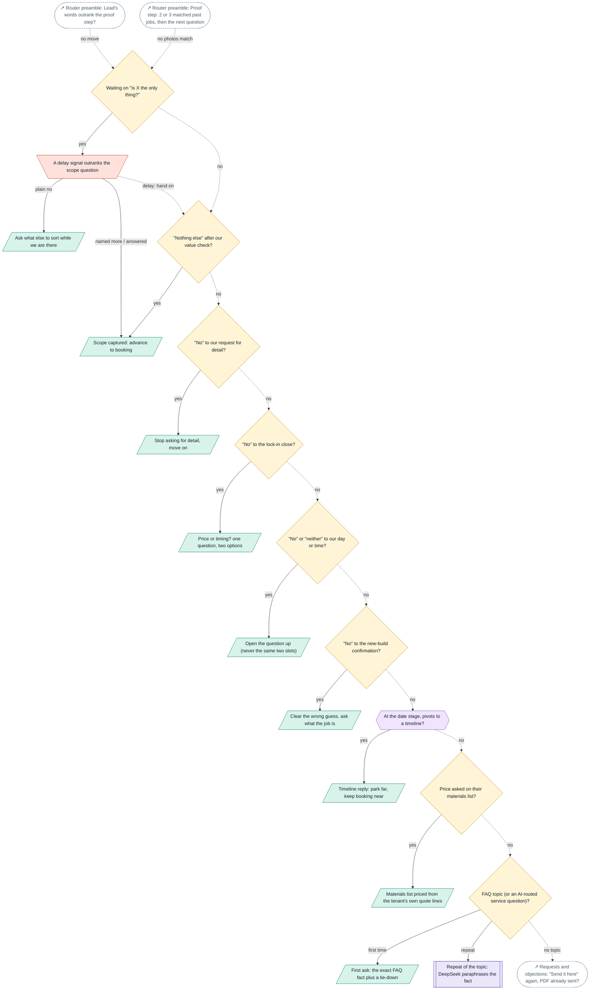

| Step | Kind | Where in the code | Wording |
|---|---|---|---|
| **Waiting on "is X the only thing?"** `p_sc` | If (code) | [`whatsapp_webhook.py`](../../bot/whatsapp_webhook.py) `_generate_and_schedule_reply` at "SERVICE-CONFIRM FOLLOW-UP" | - |
| **A delay signal outranks the scope question** `p_sc_delay` | Override gate | [`whatsapp_webhook.py`](../../bot/whatsapp_webhook.py) `_generate_and_schedule_reply` at "_sc_delay_override = (" | - |
| **Ask what else to sort while we are there** `p_sc_more` | WhatsApp message | [`whatsapp_webhook.py`](../../bot/whatsapp_webhook.py) `_generate_and_schedule_reply` at "elif _aff == 'no':" | 1 line(s) in `_generate_and_schedule_reply` |
| **Scope captured: advance to booking** `p_sc_adv` | WhatsApp message | [`response_mixin.py`](../../bot/views/plumbot/response_mixin.py) `_advance_after_scope` | `NAME_ASK_AFTER_BOOKING` |
| **"Nothing else" after our value check?** `p_vc` | If (code) | [`whatsapp_webhook.py`](../../bot/whatsapp_webhook.py) `_generate_and_schedule_reply` at "VALUE-CHECK "NOTHING ELSE"" | - |
| **"No" to our request for detail?** `p_detail` | If (code) | [`whatsapp_webhook.py`](../../bot/whatsapp_webhook.py) `_generate_and_schedule_reply` at ""NO" TO THE REQUEST FOR PROJECT DETAIL" [`response_mixin.py`](../../bot/views/plumbot/response_mixin.py) `_handle_no_to_detail_request` | - |
| **Stop asking for detail, move on** `p_detail_send` | WhatsApp message | [`response_mixin.py`](../../bot/views/plumbot/response_mixin.py) `_handle_no_to_detail_request` [`response_mixin.py`](../../bot/views/plumbot/response_mixin.py) `_get_first_pass_question` | - |
| **"No" to the lock-in close?** `p_lock` | If (code) | [`whatsapp_webhook.py`](../../bot/whatsapp_webhook.py) `_generate_and_schedule_reply` at ""NO" TO THE LOCK-IN CLOSE" [`response_mixin.py`](../../bot/views/plumbot/response_mixin.py) `_handle_no_to_lock_in` | - |
| **Price or timing? one question, two options** `p_lock_send` | WhatsApp message | [`response_mixin.py`](../../bot/views/plumbot/response_mixin.py) `_handle_no_to_lock_in` | 4 line(s) in `_handle_no_to_lock_in` |
| **"No" or "neither" to our day or time?** `p_slot` | If (code) | [`whatsapp_webhook.py`](../../bot/whatsapp_webhook.py) `_generate_and_schedule_reply` at ""NO" / "NEITHER" TO A DAY OR TIME OFFER" [`response_mixin.py`](../../bot/views/plumbot/response_mixin.py) `_handle_no_to_slot_offer` | - |
| **Open the question up (never the same two slots)** `p_slot_send` | WhatsApp message | [`response_mixin.py`](../../bot/views/plumbot/response_mixin.py) `_handle_no_to_slot_offer` | 4 line(s) in `_handle_no_to_slot_offer` |
| **"No" to the new-build confirmation?** `p_nb` | If (code) | [`whatsapp_webhook.py`](../../bot/whatsapp_webhook.py) `_generate_and_schedule_reply` at ""NO" TO THE NEW-BUILD CONFIRMATION" [`response_mixin.py`](../../bot/views/plumbot/response_mixin.py) `_handle_new_build_rejection` | - |
| **Clear the wrong guess, ask what the job is** `p_nb_send` | WhatsApp message | [`response_mixin.py`](../../bot/views/plumbot/response_mixin.py) `_handle_new_build_rejection` | 2 line(s) in `_handle_new_build_rejection` |
| **At the date stage, pivots to a timeline?** `p_pivot` | If (model) | [`whatsapp_webhook.py`](../../bot/whatsapp_webhook.py) `_generate_and_schedule_reply` at "DATE-STAGE TIMELINE PIVOT" [`response_mixin.py`](../../bot/views/plumbot/response_mixin.py) `_dispatch_timeline_pivot` | - |
| **Timeline reply: park far, keep booking near** `p_pivot_send` | WhatsApp message | [`response_mixin.py`](../../bot/views/plumbot/response_mixin.py) `_dispatch_timeline_pivot` | 6 line(s) in `_dispatch_timeline_pivot` |
| **Price asked on their materials list?** `p_list` | If (code) | [`whatsapp_webhook.py`](../../bot/whatsapp_webhook.py) `_generate_and_schedule_reply` at "A PHOTOGRAPHED MATERIALS LIST" [`whatsapp_webhook.py`](../../bot/whatsapp_webhook.py) `_materials_list_price_reply` | - |
| **Materials list priced from the tenant's own quote lines** `p_list_send` | WhatsApp message | [`materials_list.py`](../../bot/materials_list.py) `build_list_price_reply` | 7 line(s) in `build_list_price_reply` |
| **FAQ topic (or an AI-routed service question)?** `p_faq` | If (code) | [`whatsapp_webhook.py`](../../bot/whatsapp_webhook.py) `_generate_and_schedule_reply` at "FAQ LAYER" [`faq.py`](../../bot/faq.py) `match_faq_topic` [`faq.py`](../../bot/faq.py) `faq_fact` | - |
| **First ask: the exact FAQ fact plus a tie-down** `p_faq_first` | WhatsApp message | [`response_mixin.py`](../../bot/views/plumbot/response_mixin.py) `_append_tiedown` [`response_mixin.py`](../../bot/views/plumbot/response_mixin.py) `_service_continuation_reply` | 3 line(s) in `_service_continuation_reply` |
| **Repeat of the topic: DeepSeek paraphrases the fact** `p_faq_repeat` | Model writes | [`response_mixin.py`](../../bot/views/plumbot/response_mixin.py) `ai_answer_faq` | 3 line(s) in `ai_answer_faq` |

### Requests and objections

Router STEP 0-a to 1a: link questions, hesitation, the price-guide choice, multi-intent, pictures and catalogue, the budget ladder.

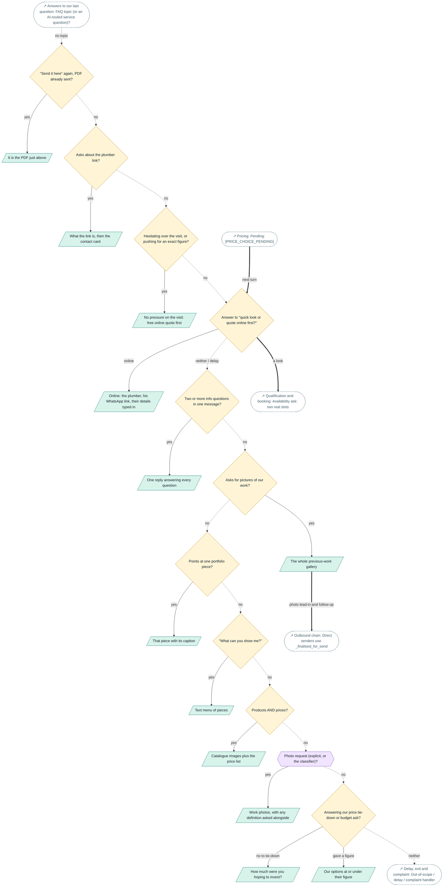

| Step | Kind | Where in the code | Wording |
|---|---|---|---|
| **"Send it here" again, PDF already sent?** `i_here` | If (code) | [`whatsapp_webhook.py`](../../bot/whatsapp_webhook.py) `_generate_and_schedule_reply` at "STEP 0-a" | - |
| **It is the PDF just above** `i_here_send` | WhatsApp message | - | `PORTFOLIO_ALREADY_HERE` |
| **Asks about the plumber link?** `i_link` | If (code) | [`whatsapp_webhook.py`](../../bot/whatsapp_webhook.py) `_generate_and_schedule_reply` at "STEP 0-:" [`plumber_link.py`](../../bot/plumber_link.py) `asks_about_the_link` | - |
| **What the link is, then the contact card** `i_link_send` | WhatsApp message | [`plumber_link.py`](../../bot/plumber_link.py) `link_explanation` [`whatsapp_webhook.py`](../../bot/whatsapp_webhook.py) `_send_reply_then_contact_card` | `LINK_WHAT_IT_IS`, `LINK_WHAT_IT_IS_NAMELESS`, `LINK_WHY_LONG`, `LINK_NOTHING_ELSE`, `LINK_OR_MESSAGE_DIRECTLY`, `LINK_OR_MESSAGE_DIRECTLY_NAMELESS` |
| **Hesitating over the visit, or pushing for an exact figure?** `i_hes` | If (code) | [`whatsapp_webhook.py`](../../bot/whatsapp_webhook.py) `_generate_and_schedule_reply` at "STEP 0-h" [`hesitation.py`](../../bot/hesitation.py) `reply_for` [`hesitation.py`](../../bot/hesitation.py) `is_visit_hesitation` [`hesitation.py`](../../bot/hesitation.py) `pushes_for_exact_figure` | - |
| **No pressure on the visit: free online quote first** `i_hes_send` | WhatsApp message | [`hesitation.py`](../../bot/hesitation.py) `reply_for` [`plumber_link.py`](../../bot/plumber_link.py) `portfolio_handoff` | `HESITATION_ACK`, `ONLINE_QUOTE_STILL_OPEN`, `ONLINE_QUOTE_STILL_OPEN_NAMELESS`, `FIRM_PRICE_NO_GUESS`, `FIRM_PRICE_ONLINE`, `PORTFOLIO_HANDOFF_FREE_FIRST`, `PORTFOLIO_HANDOFF_WHO`, `PORTFOLIO_HANDOFF_WHO_NAMELESS`, `PORTFOLIO_HANDOFF_CERTAINTY`, `PORTFOLIO_LINK_LONG`, `PORTFOLIO_LINK_DETAILS`, `PORTFOLIO_LINK_READY`, `HESITATION_ACK_SN`, `ONLINE_QUOTE_STILL_OPEN_SN`, `ONLINE_QUOTE_STILL_OPEN_NAMELESS_SN`, `FIRM_PRICE_NO_GUESS_SN`, `FIRM_PRICE_ONLINE_SN`, `PORTFOLIO_HANDOFF_FREE_FIRST_SN`, `PORTFOLIO_HANDOFF_WHO_SN`, `PORTFOLIO_HANDOFF_WHO_NAMELESS_SN`, `PORTFOLIO_HANDOFF_CERTAINTY_SN`, `PORTFOLIO_LINK_LONG_SN`, `PORTFOLIO_LINK_DETAILS_SN`, `PORTFOLIO_LINK_READY_SN` |
| **Answer to "quick look or quote online first?"** `i_choice` | If (code) | [`whatsapp_webhook.py`](../../bot/whatsapp_webhook.py) `_generate_and_schedule_reply` at "STEP 0-b" [`price_guide.py`](../../bot/price_guide.py) `read_choice` | - |
| **Online: the plumber, his WhatsApp link, their details typed in** `i_online` | WhatsApp message | [`plumber_link.py`](../../bot/plumber_link.py) `quote_offer` | `PLUMBER_QUOTE_OFFER`, `PLUMBER_QUOTE_OFFER_NAMELESS`, `LINK_OPENS_WITH_DETAILS`, `LINK_OPENS_READY`, `LINK_WHY_LONG_TAIL` |
| **Two or more info questions in one message?** `i_multi` | If (code) | [`whatsapp_webhook.py`](../../bot/whatsapp_webhook.py) `_generate_and_schedule_reply` at "STEP 0: Multi" [`response_mixin.py`](../../bot/views/plumbot/response_mixin.py) `compose_multi_answer` | - |
| **One reply answering every question** `i_multi_send` | WhatsApp message | [`response_mixin.py`](../../bot/views/plumbot/response_mixin.py) `compose_multi_answer` | 1 line(s) in `compose_multi_answer` |
| **Asks for pictures of our work?** `i_gallery` | If (code) | [`whatsapp_webhook.py`](../../bot/whatsapp_webhook.py) `_generate_and_schedule_reply` at "STEP 0a" [`whatsapp_webhook.py`](../../bot/whatsapp_webhook.py) `_explicitly_requests_photos` | - |
| **The whole previous-work gallery** `i_gallery_send` | WhatsApp message | [`whatsapp_webhook.py`](../../bot/whatsapp_webhook.py) `send_previous_work_photos` [`whatsapp_webhook.py`](../../bot/whatsapp_webhook.py) `generate_photo_followup` | 3 line(s) in `send_previous_work_photos`, 5 line(s) in `photo_followup` |
| **Points at one portfolio piece?** `i_piece` | If (code) | [`whatsapp_webhook.py`](../../bot/whatsapp_webhook.py) `_generate_and_schedule_reply` at "STEP 0b" [`portfolio_catalog.py`](../../bot/portfolio_catalog.py) `match_portfolio_item` | - |
| **That piece with its caption** `i_piece_send` | WhatsApp message | [`whatsapp_webhook.py`](../../bot/whatsapp_webhook.py) `send_portfolio_item` [`portfolio_catalog.py`](../../bot/portfolio_catalog.py) `build_item_caption` | - |
| **"What can you show me?"** `i_menu` | If (code) | [`whatsapp_webhook.py`](../../bot/whatsapp_webhook.py) `_generate_and_schedule_reply` at "STEP 0c" [`portfolio_catalog.py`](../../bot/portfolio_catalog.py) `is_catalogue_menu_request` | - |
| **Text menu of pieces** `i_menu_send` | WhatsApp message | [`portfolio_catalog.py`](../../bot/portfolio_catalog.py) `catalogue_overview` | 2 line(s) in `catalogue_overview` |
| **Products AND prices?** `i_cat` | If (code) | [`whatsapp_webhook.py`](../../bot/whatsapp_webhook.py) `_generate_and_schedule_reply` at "STEP 0d" [`whatsapp_webhook.py`](../../bot/whatsapp_webhook.py) `_explicitly_requests_catalogue` | - |
| **Catalogue images plus the price list** `i_cat_send` | WhatsApp message | [`whatsapp_webhook.py`](../../bot/whatsapp_webhook.py) `send_catalogue_images` [`whatsapp_webhook.py`](../../bot/whatsapp_webhook.py) `build_catalogue_price_text` [`whatsapp_webhook.py`](../../bot/whatsapp_webhook.py) `catalogue_price_lines` | 2 line(s) in `build_catalogue_price_text` |
| **Photo request (explicit, or the classifier)?** `i_photo` | If (model) | [`whatsapp_webhook.py`](../../bot/whatsapp_webhook.py) `_generate_and_schedule_reply` at "STEP 1:" | - |
| **Work photos, with any definition asked alongside** `i_photo_send` | WhatsApp message | [`whatsapp_webhook.py`](../../bot/whatsapp_webhook.py) `_generate_and_schedule_reply` at "STEP 1:" [`whatsapp_webhook.py`](../../bot/whatsapp_webhook.py) `_definition_answer` | 2 line(s) in `_generate_and_schedule_reply` |
| **Answering our price tie-down or budget ask?** `i_budget` | If (code) | [`whatsapp_webhook.py`](../../bot/whatsapp_webhook.py) `_generate_and_schedule_reply` at "STEP 1a" [`response_mixin.py`](../../bot/views/plumbot/response_mixin.py) `_last_assistant_was_price_tiedown` [`response_mixin.py`](../../bot/views/plumbot/response_mixin.py) `_is_budget_decline` [`response_mixin.py`](../../bot/views/plumbot/response_mixin.py) `_budget_figure` | - |
| **How much were you hoping to invest?** `i_budget_ask` | WhatsApp message | [`response_mixin.py`](../../bot/views/plumbot/response_mixin.py) `_build_budget_ask` [`response_mixin.py`](../../bot/views/plumbot/response_mixin.py) `_handle_budget_objection` | 3 line(s) in `_build_budget_ask` |
| **Our options at or under their figure** `i_budget_opts` | WhatsApp message | [`response_mixin.py`](../../bot/views/plumbot/response_mixin.py) `_build_budget_options_reply` | 7 line(s) in `_build_budget_options_reply` |

### Delay, exit and complaint

Router STEP 1b and the out-of-scope handler: timeframe, near or far, the job-date ladder, email and portfolio, complaints.

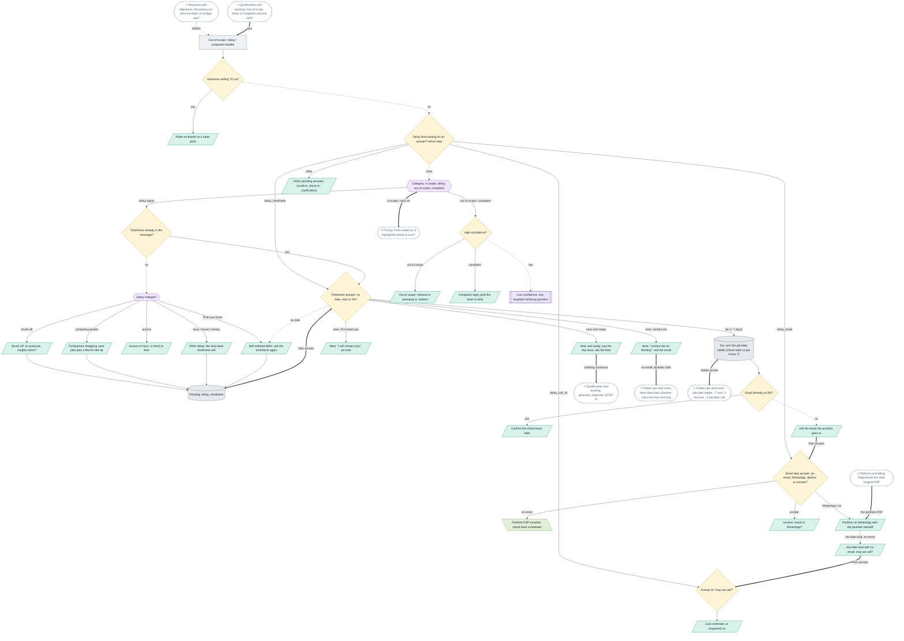

| Step | Kind | Where in the code | Wording |
|---|---|---|---|
| **Out-of-scope / delay / complaint handler** `d_oos` | Step | [`whatsapp_webhook.py`](../../bot/whatsapp_webhook.py) `_generate_and_schedule_reply` at "STEP 1b" [`out_of_scope_handler.py`](../../bot/out_of_scope_handler.py) `handle_out_of_scope` | - |
| **Someone selling TO us?** `d_pitch` | If (code) | [`out_of_scope_handler.py`](../../bot/out_of_scope_handler.py) `is_inbound_sales_pitch` | - |
| **Polite no-thanks to a sales pitch** `d_pitch_send` | WhatsApp message | [`out_of_scope_handler.py`](../../bot/out_of_scope_handler.py) `build_sales_pitch_reply` | 1 line(s) in `build_sales_pitch_reply` |
| **Delay flow waiting on an answer? which step** `d_pending` | If (code) | [`out_of_scope_handler.py`](../../bot/out_of_scope_handler.py) `handle_out_of_scope` at "Step 1: pending states" [`out_of_scope_handler.py`](../../bot/out_of_scope_handler.py) `_read_pending` | - |
| **Category: in scope, delay, out of scope, complaint** `d_cat` | If (model) | [`out_of_scope_handler.py`](../../bot/out_of_scope_handler.py) `handle_out_of_scope` at "Step 2: classify" [`out_of_scope_handler.py`](../../bot/out_of_scope_handler.py) `classify_message` | - |
| **Timeframe already in the message?** `d_has_tf` | If (code) | [`out_of_scope_handler.py`](../../bot/out_of_scope_handler.py) `handle_out_of_scope` at "Step 4: delay signal" [`out_of_scope_handler.py`](../../bot/out_of_scope_handler.py) `_message_has_timeframe` | - |
| **Delay subtype?** `d_sub` | If (model) | [`out_of_scope_handler.py`](../../bot/out_of_scope_handler.py) `_build_delay_reply` [`out_of_scope_handler.py`](../../bot/out_of_scope_handler.py) `_classify_delay_subtype` | - |
| **Brush-off: no pressure, roughly when?** `d_brush` | WhatsApp message | [`out_of_scope_handler.py`](../../bot/out_of_scope_handler.py) `_build_delay_reply` at "if subtype == 'brush_off':" | 2 line(s) in `_build_delay_reply` |
| **Comparison shopping: past jobs plus a like-for-like tip** `d_compare` | WhatsApp message | [`out_of_scope_handler.py`](../../bot/out_of_scope_handler.py) `_build_delay_reply` at "if subtype == 'comparison_shopping':" | 3 line(s) in `_build_delay_reply` |
| **Access or keys: a check-in time** `d_access` | WhatsApp message | [`out_of_scope_handler.py`](../../bot/out_of_scope_handler.py) `_build_access_checkin_reply` | 1 line(s) in `_build_access_checkin_reply` |
| **Self-initiated defer: ask the timeframe again** `d_selfdefer` | WhatsApp message | [`out_of_scope_handler.py`](../../bot/out_of_scope_handler.py) `_reask_delay_timeframe` | 4 line(s) in `_reask_delay_timeframe`, `BEST_EMAIL_ASK`, 1 line(s) in `_EMAIL_VALUE_CLAUSE` |
| **Other delay: the slow-lead timeframe ask** `d_nudge` | WhatsApp message | [`controller_templates.py`](../../bot/controller_templates.py) `slow_lead_nudge` [`out_of_scope_handler.py`](../../bot/out_of_scope_handler.py) `_DELAY_SUBTYPE_REPLIES` | 6 line(s) in `slow_lead_nudge`, 2 line(s) in `_timeframe_ask`, 4 line(s) in `_DELAY_SUBTYPE_REPLIES` |
| **Pending: delay_timeframe** `d_pend_tf` | State | [`out_of_scope_handler.py`](../../bot/out_of_scope_handler.py) `_write_pending` [`out_of_scope_handler.py`](../../bot/out_of_scope_handler.py) `_note_timeframe_asked` | - |
| **Timeframe answer: no date, near or far?** `d_tf` | If (code) | [`out_of_scope_handler.py`](../../bot/out_of_scope_handler.py) `_handle_delay_timeframe_answer` [`out_of_scope_handler.py`](../../bot/out_of_scope_handler.py) `_compute_followup_date` | - |
| **Near, "contact me on Monday": ask the email** `d_near2` | WhatsApp message | [`out_of_scope_handler.py`](../../bot/out_of_scope_handler.py) `_handle_delay_timeframe_answer` at "if _near and _english:" | `NEAR_EMAIL_ASK`, `NEAR_WE_WILL_CALL` |
| **Near, "I will contact you": we wait** `d_near1` | WhatsApp message | [`out_of_scope_handler.py`](../../bot/out_of_scope_handler.py) `_near_they_will_contact` | `NEAR_WAIT_FOR_THEM`, `NEAR_EMAIL_FOR_PORTFOLIO`, `NEAR_PORTFOLIO_EMAILED` |
| **Near and ready: say the day back, ask the time** `d_near_book` | WhatsApp message | [`out_of_scope_handler.py`](../../bot/out_of_scope_handler.py) `_handle_delay_timeframe_answer` at "if _near and not _near_contact_with_email and not _self_defer:" | 4 line(s) in `_handle_delay_timeframe_answer` |
| **Far: arm the job-date ladder (check back at job minus 7)** `d_ladder` | State | [`out_of_scope_handler.py`](../../bot/out_of_scope_handler.py) `_ladder_delay_reply` [`job_date_ladder.py`](../../bot/job_date_ladder.py) `arm` [`out_of_scope_handler.py`](../../bot/out_of_scope_handler.py) `_store_delay_followup_date` | 5 line(s) in `_ladder_delay_reply`, `BEST_EMAIL_ASK`, 1 line(s) in `_EMAIL_VALUE_CLAUSE` |
| **Email already on file?** `d_has_email` | If (code) | [`out_of_scope_handler.py`](../../bot/out_of_scope_handler.py) `_handle_delay_timeframe_answer` at "if getattr(appointment, 'customer_email', None):" | - |
| **Confirm the check-back date** `d_confirm_send` | WhatsApp message | - | 3 line(s) in `_handle_delay_timeframe_answer` |
| **Ask the email the portfolio goes to** `d_email_ask` | WhatsApp message | [`out_of_scope_handler.py`](../../bot/out_of_scope_handler.py) `_delay_email_ask` | 2 line(s) in `_delay_email_ask`, `BEST_EMAIL_ASK`, 1 line(s) in `_EMAIL_VALUE_CLAUSE` |
| **Email step answer: an email, WhatsApp, decline or unclear?** `d_email` | If (code) | [`out_of_scope_handler.py`](../../bot/out_of_scope_handler.py) `_handle_delay_email_answer` [`out_of_scope_handler.py`](../../bot/out_of_scope_handler.py) `_classify_email_step_reply` | - |
| **Portfolio PDF emailed, check-back scheduled** `d_email_sent` | Email / PDF | [`out_of_scope_handler.py`](../../bot/out_of_scope_handler.py) `_deliver_pdf_and_schedule_checkin` | 4 line(s) in `_handle_delay_email_answer`, `NEAR_EMAIL_THANKS` |
| **Portfolio on WhatsApp with the plumber handoff** `d_wa_portfolio` | WhatsApp message | [`out_of_scope_handler.py`](../../bot/out_of_scope_handler.py) `_portfolio_on_whatsapp_ack` [`out_of_scope_handler.py`](../../bot/out_of_scope_handler.py) `send_lead_magnet_on_whatsapp` | `PORTFOLIO_HERE_ACK`, `PORTFOLIO_SENT_ACK`, `LADDER_CALL_ASK`, `NEAR_WE_WILL_CALL` |
| **Job-date lead with no email: may we call?** `d_call_ask` | WhatsApp message | - | `LADDER_CALL_ASK` |
| **Answer to "may we call?"** `d_call` | If (code) | [`out_of_scope_handler.py`](../../bot/out_of_scope_handler.py) `_handle_call_permission_answer` | - |
| **Call confirmed, or respected no** `d_call_send` | WhatsApp message | - | `LADDER_CALL_YES`, `LADDER_CALL_NO` |
| **Unclear: email or WhatsApp?** `d_choice_q` | WhatsApp message | [`out_of_scope_handler.py`](../../bot/out_of_scope_handler.py) `_delivery_choice_question` | 1 line(s) in `_DELIVERY_CHOICE_QUESTION`, 1 line(s) in `_DELIVERY_CHOICE_TIMEFRAME_TAIL` |
| **Other pending answers (confirm, check-in, clarification)** `d_other_pending` | WhatsApp message | [`out_of_scope_handler.py`](../../bot/out_of_scope_handler.py) `_handle_delay_confirm_answer` [`out_of_scope_handler.py`](../../bot/out_of_scope_handler.py) `_handle_delay_checkin_answer` [`out_of_scope_handler.py`](../../bot/out_of_scope_handler.py) `_resolve_pending_clarification` | 2 line(s) in `_handle_delay_confirm_answer`, 2 line(s) in `_handle_delay_checkin_answer` |
| **High confidence?** `d_high` | If (code) | [`out_of_scope_handler.py`](../../bot/out_of_scope_handler.py) `handle_out_of_scope` at "Step 5: HIGH confidence" | - |
| **Out of scope: reframe to plumbing or redirect** `d_oos_send` | WhatsApp message | [`out_of_scope_handler.py`](../../bot/out_of_scope_handler.py) `_generate_clarifying_question` [`out_of_scope_handler.py`](../../bot/out_of_scope_handler.py) `_build_oos_reply` | 2 line(s) in `_build_oos_reply`, 3 line(s) in `_FALLBACK_CLARIFIERS`, 6 line(s) in `_generate_clarifying_question` |
| **Complaint reply (and the team is told)** `d_complaint` | WhatsApp message | [`out_of_scope_handler.py`](../../bot/out_of_scope_handler.py) `_build_complaint_reply` | 9 line(s) in `_build_complaint_reply` |
| **Low confidence: one targeted clarifying question** `d_clarify` | Model writes | [`out_of_scope_handler.py`](../../bot/out_of_scope_handler.py) `handle_out_of_scope` at "Step 6: LOW confidence" [`out_of_scope_handler.py`](../../bot/out_of_scope_handler.py) `_generate_clarifying_question` | - |

### Pricing

Router STEP 1c to 3c: a highlighted photo, the price guide, product prices, quotes lean to the visit, the overview, repeats, new builds.

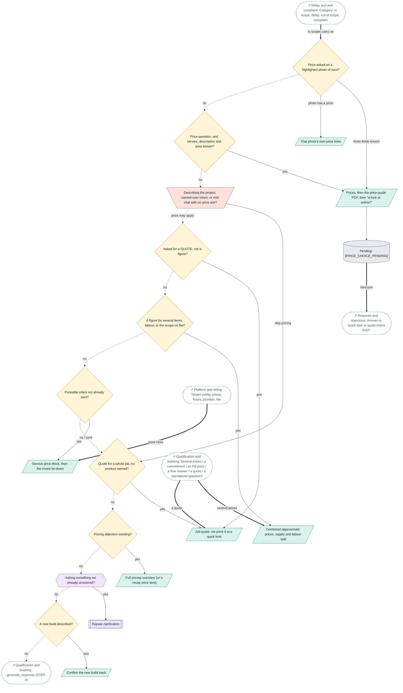

| Step | Kind | Where in the code | Wording |
|---|---|---|---|
| **Price asked on a highlighted photo of ours?** `pr_1c` | If (code) | [`whatsapp_webhook.py`](../../bot/whatsapp_webhook.py) `_generate_and_schedule_reply` at "STEP 1c" [`whatsapp_webhook.py`](../../bot/whatsapp_webhook.py) `_quoted_portfolio_item` | - |
| **That photo's own price lines** `pr_1c_send` | WhatsApp message | [`whatsapp_webhook.py`](../../bot/whatsapp_webhook.py) `_quoted_portfolio_price_reply` [`media_library.py`](../../bot/media_library.py) `price_line_for_item` | - |
| **Price question, and service, description and area known?** `pr_1d` | If (code) | [`whatsapp_webhook.py`](../../bot/whatsapp_webhook.py) `_generate_and_schedule_reply` at "STEP 1d" [`price_guide.py`](../../bot/price_guide.py) `applies` [`price_guide.py`](../../bot/price_guide.py) `three_fields` | - |
| **Prices, then the price-guide PDF, then "a look or online?"** `pr_guide` | WhatsApp message | [`whatsapp_webhook.py`](../../bot/whatsapp_webhook.py) `_start_price_guide` [`whatsapp_webhook.py`](../../bot/whatsapp_webhook.py) `_send_price_guide` [`whatsapp_webhook.py`](../../bot/whatsapp_webhook.py) `_price_guide_prices` | `PRICE_GUIDE_INTRO`, `PRICE_GUIDE_ALREADY_SENT`, `PRICE_CHOICE_ASK`, `PRICE_GUIDE_INTRO_SN`, `PRICE_GUIDE_ALREADY_SENT_SN`, `PRICE_CHOICE_ASK_SN` |
| **Pending: [PRICE_CHOICE_PENDING]** `pr_choice_tag` | State | [`price_guide.py`](../../bot/price_guide.py) `read_choice` | - |
| **Describing the project, carried-over intent, or mid-chat with no price ask?** `pr_skip` | Override gate | [`whatsapp_webhook.py`](../../bot/whatsapp_webhook.py) `_generate_and_schedule_reply` at "STEP 2:" [`whatsapp_webhook.py`](../../bot/whatsapp_webhook.py) `_is_unprompted_carryover_pricing` | - |
| **Asked for a QUOTE, not a figure?** `pr_quote` | If (code) | [`response_mixin.py`](../../bot/views/plumbot/response_mixin.py) `_asks_for_quote` [`response_mixin.py`](../../bot/views/plumbot/response_mixin.py) `_is_job_quote_request` | - |
| **Job quote: we price it at a quick look** `pr_quote_send` | WhatsApp message | [`response_mixin.py`](../../bot/views/plumbot/response_mixin.py) `_build_job_quote_reply` | 4 line(s) in `_build_job_quote_reply` |
| **A figure for several items, labour, or the scope on file?** `pr_multi` | If (code) | [`response_mixin.py`](../../bot/views/plumbot/response_mixin.py) `_names_multiple_products` [`response_mixin.py`](../../bot/views/plumbot/response_mixin.py) `_context_product_families` | - |
| **Combined approximate prices, supply and labour split** `pr_multi_send` | WhatsApp message | [`response_mixin.py`](../../bot/views/plumbot/response_mixin.py) `_build_combined_price_reply` | 2 line(s) in `_build_combined_price_reply`, `STARTING_PRICES_DISCLAIMER_SN`, `STARTING_PRICES_DISCLAIMER` |
| **Priceable intent not already sent?** `pr_single` | If (code) | [`whatsapp_webhook.py`](../../bot/whatsapp_webhook.py) `_has_sent_pricing_for_intent` [`whatsapp_webhook.py`](../../bot/whatsapp_webhook.py) `_mark_pricing_intent_sent` | - |
| **Service price block, then the invest tie-down** `pr_single_send` | WhatsApp message | [`response_mixin.py`](../../bot/views/plumbot/response_mixin.py) `handle_service_inquiry` [`response_mixin.py`](../../bot/views/plumbot/response_mixin.py) `_replacement_price_reply` [`response_mixin.py`](../../bot/views/plumbot/response_mixin.py) `_price_tiedown` | 1 line(s) in `_price_tiedown`, 15 line(s) in `_replacement_price_reply`, `STARTING_PRICES_DISCLAIMER`, `STARTING_PRICES_DISCLAIMER_SN`, `MATERIALS_LABOUR_INCLUDED` |
| **Quote for a whole job, no product named?** `pr_2b` | If (code) | [`whatsapp_webhook.py`](../../bot/whatsapp_webhook.py) `_generate_and_schedule_reply` at "STEP 2b" [`whatsapp_webhook.py`](../../bot/whatsapp_webhook.py) `_routes_to_onsite_quote` | - |
| **Pricing objection wording?** `pr_3` | If (code) | [`whatsapp_webhook.py`](../../bot/whatsapp_webhook.py) `_generate_and_schedule_reply` at "STEP 3:" [`whatsapp_webhook.py`](../../bot/whatsapp_webhook.py) `detect_objection_type` [`whatsapp_webhook.py`](../../bot/whatsapp_webhook.py) `_is_genuine_pricing_question` | - |
| **Full pricing overview (or a recap once sent)** `pr_overview` | WhatsApp message | [`response_mixin.py`](../../bot/views/plumbot/response_mixin.py) `generate_pricing_overview` [`response_mixin.py`](../../bot/views/plumbot/response_mixin.py) `_pricing_overview_recap` | 3 line(s) in `generate_pricing_overview`, 5 line(s) in `_pricing_overview_recap` |
| **Asking something we already answered?** `pr_3b` | If (model) | [`whatsapp_webhook.py`](../../bot/whatsapp_webhook.py) `_generate_and_schedule_reply` at "STEP 3b" [`repeated_question_detector.py`](../../bot/repeated_question_detector.py) `detect_repeated_question` | - |
| **Repeat clarification** `pr_3b_send` | Model writes | [`repeated_question_detector.py`](../../bot/repeated_question_detector.py) `generate_repeat_clarification` | 8 line(s) in `generate_repeat_clarification` |
| **A new build described?** `pr_3c` | If (code) | [`whatsapp_webhook.py`](../../bot/whatsapp_webhook.py) `_generate_and_schedule_reply` at "STEP 3c" [`response_mixin.py`](../../bot/views/plumbot/response_mixin.py) `_new_build_confirmation` | - |
| **Confirm the new build back** `pr_3c_send` | WhatsApp message | [`response_mixin.py`](../../bot/views/plumbot/response_mixin.py) `_new_build_confirmation` [`response_mixin.py`](../../bot/views/plumbot/response_mixin.py) `_new_build_confirm_question` | 2 line(s) in `_new_build_confirm_question` |

### Qualification and booking

Router STEP 4, generate_response: extraction, the question order, the scripted first ask, retries, booking and the name ask.

```mermaid
flowchart TD
  q_start["generate_response (STEP 4)"]
  class q_start k_step
  q_emailcap{"Post-booking email capture pending?"}
  class q_emailcap k_decision
  q_delay{"Delay signal active?"}
  class q_delay k_decision
  q_exit{"First-time delay or exit signal?"}
  class q_exit k_decision
  q_direct{"A direct question first?"}
  class q_direct k_decision
  q_budget{"A no to our budget tie-down?"}
  class q_budget k_decision
  q_materials{"Asking for a materials list?"}
  class q_materials k_decision
  q_bareack{"Bare #quot;ok#quot; at the service-type stage?"}
  class q_bareack k_decision
  q_oos{"Out of scope, delay or complaint (second net)?"}
  class q_oos k_decision
  q_size{"A size or spec question?"}
  class q_size k_decision
  q_catalogue{"Catalogue or product list?"}
  class q_catalogue k_decision
  q_pricing{"Product pricing, before booking?"}
  class q_pricing k_decision
  q_plan{"Plan upload flow?"}
  class q_plan k_decision
  q_planfar{"Plan lead, timeline beyond the week?"}
  class q_planfar k_decision
  q_confirmed{"Confirmed and complete?"}
  class q_confirmed k_decision
  q_alt{"Picking one of the alternative times we listed?"}
  class q_alt k_decision
  q_extract[["Extract everything in the message"]]
  class q_extract k_ai_write
  q_planlater{"#quot;I will send the plan later#quot;?"}
  class q_planlater k_decision
  q_update[("Update the appointment with what was extracted")]
  class q_update k_data
  q_excluded{"Excluded area?"}
  class q_excluded k_decision
  q_excluded_send[/"Out-of-area decline"/]
  class q_excluded_send k_send
  q_resched{"A confirmed lead asking to reschedule?"}
  class q_resched k_decision
  q_resched_send[/"Reschedule reply"/]
  class q_resched_send k_send
  q_garage{"Garage or outbuilding scope question?"}
  class q_garage k_decision
  q_ready{"Ready to book? every field in, slot valid"}
  class q_ready k_decision
  q_book[("Book: status confirmed, diary, calendar")]
  class q_book k_data
  q_confirm_msg[/"Booking confirmation (queued, deterministic)"/]
  class q_confirm_msg k_send
  q_team>"Team and plumber told of the booking"]
  class q_team k_notify
  q_name[/"Ask the name for the booking"/]
  class q_name k_send
  q_slot_bad[/"Slot not available: alternatives"/]
  class q_slot_bad k_send
  q_else{"Several prices / a commitment / an FB price / a flow answer / a quote / a standalone question?"}
  class q_else k_decision
  q_standalone[/"Answer the standalone question, then a soft nudge"/]
  class q_standalone k_send
  q_next{"Next question in the order"}
  class q_next k_decision
  q_contextual[["generate_contextual_response"]]
  class q_contextual k_ai_write
  q_retry{"Asked this question before? (retry count)"}
  class q_retry k_decision
  q_script[/"First ask: the exact approved script"/]
  class q_script k_send
  q_opener[/"The owner's opener"/]
  class q_opener k_send
  q_avail[/"Availability ask: two real slots"/]
  class q_avail k_send
  q_retry_send[["Retry: rephrase as two choices, then shorter"]]
  class q_retry_send k_ai_write
  q_complete((("Complete: no reply")))
  class q_complete k_end
  q_fallback[/"Didn't catch that"/]
  class q_fallback k_send
  i_choice(["↗ Requests and objections: Answer to #quot;quick look or quote online first?#quot;"])
  class i_choice ext
  i_choice ==>|"a look"| q_avail
  d_near_book(["↗ Delay, exit and complaint: Near and ready: say the day back, ask the time"])
  class d_near_book ext
  d_near_book ==>|"booking continues"| q_start
  pr_3c(["↗ Pricing: A new build described?"])
  class pr_3c ext
  pr_3c -.->|"no"| q_start
  q_start --> q_emailcap
  q_emailcap -.->|"no"| q_delay
  q_delay -.->|"no"| q_exit
  q_exit -.->|"no"| q_direct
  q_direct -.->|"no"| q_budget
  q_budget -.->|"no"| q_materials
  q_materials -.->|"no"| q_bareack
  q_bareack -.->|"no"| q_oos
  q_oos -.->|"no"| q_size
  q_size -.->|"no"| q_catalogue
  q_catalogue -.->|"no"| q_pricing
  q_pricing -.->|"no"| q_plan
  q_plan -.->|"no"| q_planfar
  q_planfar -.->|"no"| q_confirmed
  q_confirmed -.->|"no"| q_alt
  q_alt -.->|"no"| q_extract
  q_alt -->|"picked one"| q_book
  d_oos(["↗ Delay, exit and complaint: Out-of-scope / delay / complaint handler"])
  class d_oos ext
  q_oos ==>|"yes"| d_oos
  pv_plan_req(["↗ Visit, quote and plan path: PlanQuoteRequest opened"])
  class pv_plan_req ext
  q_plan ==>|"plan path"| pv_plan_req
  q_extract --> q_planlater
  q_planlater -.->|"no"| q_update
  q_update --> q_excluded
  q_excluded -->|"yes"| q_excluded_send
  q_excluded -.->|"no"| q_resched
  q_resched -->|"yes"| q_resched_send
  q_resched -.->|"no"| q_garage
  q_garage -.->|"no"| q_ready
  q_ready -->|"yes"| q_book
  q_book --> q_confirm_msg
  q_book --> q_team
  q_book --> q_name
  q_ready -->|"slot not free"| q_slot_bad
  q_ready -.->|"not ready"| q_else
  q_else -->|"standalone question"| q_standalone
  pr_multi_send(["↗ Pricing: Combined approximate prices, supply and labour split"])
  class pr_multi_send ext
  q_else ==>|"several prices"| pr_multi_send
  pr_quote_send(["↗ Pricing: Job quote: we price it at a quick look"])
  class pr_quote_send ext
  q_else ==>|"a quote"| pr_quote_send
  q_else -.->|"anything else"| q_contextual
  q_contextual --> q_next
  q_next -->|"a field is missing"| q_retry
  q_next -->|"complete"| q_complete
  q_retry -->|"first ask, service type"| q_opener
  q_retry -->|"first ask, date"| q_avail
  q_retry -->|"first ask, other"| q_script
  q_retry -->|"asked before"| q_retry_send
  q_contextual -.->|"empty"| q_fallback
  ob_chain(["↗ Outbound chain: finalise_outbound(reply)"])
  class ob_chain ext
  q_contextual ==>|"reply ready"| ob_chain
  classDef k_trigger fill:#d9ecff,stroke:#2f6fb3,color:#14212b
  classDef k_step fill:#eef2f4,stroke:#5b6f7a,color:#14212b
  classDef k_decision fill:#fff4d6,stroke:#b8860b,color:#14212b
  classDef k_ai_decision fill:#f0e4ff,stroke:#7b4bc4,color:#14212b
  classDef k_gate fill:#ffe1dc,stroke:#c0392b,color:#14212b
  classDef k_send fill:#d8f3ea,stroke:#0b7a75,color:#14212b
  classDef k_email fill:#e2f0d9,stroke:#4d8a2c,color:#14212b
  classDef k_ai_write fill:#ece6fb,stroke:#5e45a8,color:#14212b
  classDef k_data fill:#e6e9ee,stroke:#46545f,color:#14212b
  classDef k_staff fill:#ffe9d1,stroke:#c26a17,color:#14212b
  classDef k_notify fill:#fde2ef,stroke:#b03a74,color:#14212b
  classDef k_loop fill:#dff4f8,stroke:#1f8aa0,color:#14212b
  classDef k_wait fill:#f4f0e6,stroke:#8c7a4f,color:#14212b
  classDef k_end fill:#ffffff,stroke:#14212b,color:#14212b
  classDef ext fill:#ffffff,stroke:#8aa0ab,stroke-dasharray:4 3,color:#46606c
```

| Step | Kind | Where in the code | Wording |
|---|---|---|---|
| **generate_response (STEP 4)** `q_start` | Step | [`whatsapp_webhook.py`](../../bot/whatsapp_webhook.py) `_generate_and_schedule_reply` at "STEP 4:" [`response_mixin.py`](../../bot/views/plumbot/response_mixin.py) `generate_response` | - |
| **Post-booking email capture pending?** `q_emailcap` | If (code) | [`response_mixin.py`](../../bot/views/plumbot/response_mixin.py) `generate_response` at "EMAIL CAPTURE (post-booking)" [`state_mixin.py`](../../bot/views/plumbot/state_mixin.py) `_handle_email_capture` | - |
| **Delay signal active?** `q_delay` | If (code) | [`response_mixin.py`](../../bot/views/plumbot/response_mixin.py) `generate_response` at "DELAY SIGNAL ACTIVE" | - |
| **First-time delay or exit signal?** `q_exit` | If (code) | [`response_mixin.py`](../../bot/views/plumbot/response_mixin.py) `generate_response` at "FIRST-TIME DELAY / EXIT SIGNAL" | - |
| **A direct question first?** `q_direct` | If (code) | [`response_mixin.py`](../../bot/views/plumbot/response_mixin.py) `generate_response` at "DIRECT QUESTION FIRST" | - |
| **A no to our budget tie-down?** `q_budget` | If (code) | [`response_mixin.py`](../../bot/views/plumbot/response_mixin.py) `generate_response` at "BUDGET OBJECTION (a 'no'" | - |
| **Asking for a materials list?** `q_materials` | If (code) | [`response_mixin.py`](../../bot/views/plumbot/response_mixin.py) `generate_response` at "MATERIALS REQUEST" | - |
| **Bare "ok" at the service-type stage?** `q_bareack` | If (code) | [`response_mixin.py`](../../bot/views/plumbot/response_mixin.py) `generate_response` at "Bare ack ("ok"" | - |
| **Out of scope, delay or complaint (second net)?** `q_oos` | If (code) | [`response_mixin.py`](../../bot/views/plumbot/response_mixin.py) `generate_response` at "OUT-OF-SCOPE / DELAY / COMPLAINT HANDLER" | - |
| **A size or spec question?** `q_size` | If (code) | [`response_mixin.py`](../../bot/views/plumbot/response_mixin.py) `generate_response` at "PRODUCT SIZE / SPEC QUESTION" | - |
| **Catalogue or product list?** `q_catalogue` | If (code) | [`response_mixin.py`](../../bot/views/plumbot/response_mixin.py) `generate_response` at "CATALOGUE / PRODUCT LIST REQUEST" | - |
| **Product pricing, before booking?** `q_pricing` | If (code) | [`response_mixin.py`](../../bot/views/plumbot/response_mixin.py) `generate_response` at "SERVICE / PRODUCT PRICING INQUIRIES" | - |
| **Plan upload flow?** `q_plan` | If (code) | [`response_mixin.py`](../../bot/views/plumbot/response_mixin.py) `generate_response` at "PLAN UPLOAD FLOW" [`plan_upload_mixin.py`](../../bot/views/plumbot/plan_upload_mixin.py) `handle_plan_upload_flow` | - |
| **Plan lead, timeline beyond the week?** `q_planfar` | If (code) | [`response_mixin.py`](../../bot/views/plumbot/response_mixin.py) `generate_response` at "PLAN LEAD WHOSE TIMELINE IS BEYOND THE WEEK" | - |
| **Confirmed and complete?** `q_confirmed` | If (code) | [`response_mixin.py`](../../bot/views/plumbot/response_mixin.py) `generate_response` at "CONFIRMED + COMPLETE" | - |
| **Picking one of the alternative times we listed?** `q_alt` | If (code) | [`response_mixin.py`](../../bot/views/plumbot/response_mixin.py) `generate_response` at "ALTERNATIVE TIME SELECTION" [`booking_mixin.py`](../../bot/views/plumbot/booking_mixin.py) `process_alternative_time_selection` [`booking_mixin.py`](../../bot/views/plumbot/booking_mixin.py) `book_appointment_with_selected_time` | - |
| **Extract everything in the message** `q_extract` | Model writes | [`response_mixin.py`](../../bot/views/plumbot/response_mixin.py) `generate_response` at "STEP 2: EXTRACT ALL AVAILABLE INFO" | - |
| **"I will send the plan later"?** `q_planlater` | If (code) | [`response_mixin.py`](../../bot/views/plumbot/response_mixin.py) `generate_response` at "PLAN LATER RESPONSE" [`plan_upload_mixin.py`](../../bot/views/plumbot/plan_upload_mixin.py) `handle_plan_later_response` | - |
| **Update the appointment with what was extracted** `q_update` | State | [`response_mixin.py`](../../bot/views/plumbot/response_mixin.py) `generate_response` at "STEP 3: UPDATE APPOINTMENT" [`extraction_mixin.py`](../../bot/views/plumbot/extraction_mixin.py) `update_appointment_with_extracted_data` | - |
| **Excluded area?** `q_excluded` | If (code) | [`response_mixin.py`](../../bot/views/plumbot/response_mixin.py) `generate_response` at "EXCLUDED AREA" | - |
| **Out-of-area decline** `q_excluded_send` | WhatsApp message | - | 1 line(s) in `generate_response` |
| **A confirmed lead asking to reschedule?** `q_resched` | If (code) | [`response_mixin.py`](../../bot/views/plumbot/response_mixin.py) `generate_response` at "STEP 4: RESCHEDULE CHECK" [`reschedule_mixin.py`](../../bot/views/plumbot/reschedule_mixin.py) `handle_reschedule_request_with_ai` | - |
| **Reschedule reply** `q_resched_send` | WhatsApp message | [`reschedule_mixin.py`](../../bot/views/plumbot/reschedule_mixin.py) `_build_reschedule_confirmation` [`reschedule_mixin.py`](../../bot/views/plumbot/reschedule_mixin.py) `_build_reschedule_unavailable_reply` [`reschedule_mixin.py`](../../bot/views/plumbot/reschedule_mixin.py) `_build_reschedule_clarification` | 2 line(s) in `_build_reschedule_confirmation`, 4 line(s) in `_build_reschedule_unavailable_reply`, 2 line(s) in `_build_reschedule_clarification` |
| **Garage or outbuilding scope question?** `q_garage` | If (code) | [`response_mixin.py`](../../bot/views/plumbot/response_mixin.py) `generate_response` at "GARAGE / OUTBUILDING" | - |
| **Ready to book? every field in, slot valid** `q_ready` | If (code) | [`response_mixin.py`](../../bot/views/plumbot/response_mixin.py) `generate_response` at "STEPS 5 & 6" [`booking_mixin.py`](../../bot/views/plumbot/booking_mixin.py) `smart_booking_check` [`extraction_mixin.py`](../../bot/views/plumbot/extraction_mixin.py) `_job_is_known` | - |
| **Book: status confirmed, diary, calendar** `q_book` | State | [`booking_mixin.py`](../../bot/views/plumbot/booking_mixin.py) `book_appointment` | - |
| **Booking confirmation (queued, deterministic)** `q_confirm_msg` | WhatsApp message | [`notification_mixin.py`](../../bot/views/plumbot/notification_mixin.py) `send_confirmation_message` [`notification_mixin.py`](../../bot/views/plumbot/notification_mixin.py) `_build_confirmation_message` | 11 line(s) in `_build_confirmation_message` |
| **Team and plumber told of the booking** `q_team` | Internal alert | [`notification_mixin.py`](../../bot/views/plumbot/notification_mixin.py) `notify_team` | - |
| **Ask the name for the booking** `q_name` | WhatsApp message | [`booking_mixin.py`](../../bot/views/plumbot/booking_mixin.py) `_name_ask_after_booking` | `NAME_ASK_AFTER_BOOKING` |
| **Slot not available: alternatives** `q_slot_bad` | WhatsApp message | [`response_mixin.py`](../../bot/views/plumbot/response_mixin.py) `generate_response` at "if reason in ('closed_day', 'saturday_closed'):" [`availability_mixin.py`](../../bot/views/plumbot/availability_mixin.py) `get_availability_error_message` | 2 line(s) in `generate_response`, `SUGGEST_ANOTHER_SLOT`, `WHICH_WORKS_BETTER`, `WHICH_TIME_WORKS`, `TIME_UNAVAILABLE_SHORT`, `TIME_UNAVAILABLE`, `TIME_UNAVAILABLE_SUGGEST`, `SLOT_UNAVAILABLE`, `TIME_IN_THE_PAST`, `TIME_ALREADY_BOOKED`, `TOO_FAR_AHEAD`, `AVAILABILITY_CHECK_FAILED`, `CHOOSE_ANOTHER_DAY`, `EMERGENCY_OFFER` |
| **Several prices / a commitment / an FB price / a flow answer / a quote / a standalone question?** `q_else` | If (code) | [`response_mixin.py`](../../bot/views/plumbot/response_mixin.py) `generate_response` at "_asks_figure = self._asks_price_figure(" [`response_mixin.py`](../../bot/views/plumbot/response_mixin.py) `_is_purchase_commitment` [`response_mixin.py`](../../bot/views/plumbot/response_mixin.py) `_is_standalone_question` | - |
| **Answer the standalone question, then a soft nudge** `q_standalone` | WhatsApp message | [`response_mixin.py`](../../bot/views/plumbot/response_mixin.py) `_answer_standalone_question` [`response_mixin.py`](../../bot/views/plumbot/response_mixin.py) `_get_soft_booking_nudge` | 7 line(s) in `_get_soft_booking_nudge`, 4 line(s) in `_facebook_price_confirm_reply` |
| **Next question in the order** `q_next` | If (code) | [`extraction_mixin.py`](../../bot/views/plumbot/extraction_mixin.py) `get_next_question_to_ask` [`extraction_mixin.py`](../../bot/views/plumbot/extraction_mixin.py) `next_question_for_turn` | - |
| **generate_contextual_response** `q_contextual` | Model writes | [`response_mixin.py`](../../bot/views/plumbot/response_mixin.py) `generate_contextual_response` | - |
| **Asked this question before? (retry count)** `q_retry` | If (code) | [`state_mixin.py`](../../bot/views/plumbot/state_mixin.py) `_get_question_retry_count` | - |
| **First ask: the exact approved script** `q_script` | WhatsApp message | [`response_mixin.py`](../../bot/views/plumbot/response_mixin.py) `_get_first_pass_question` [`photo_ask.py`](../../bot/photo_ask.py) `area_ask` | 4 line(s) in `_get_first_pass_question`, `TIME_ASK_TWO_SLOTS`, `AREA_ASK_AFTER_NO`, `AREA_ASK_AFTER_JOB`, `AREA_ASK_PLAIN`, `AREA_ASK_WHEREABOUTS`, `DESCRIBE_THE_JOB`, `OTHER_WORK_WHILE_THERE` |
| **The owner's opener** `q_opener` | WhatsApp message | [`response_mixin.py`](../../bot/views/plumbot/response_mixin.py) `build_cold_opener` | `OPENER_INFO`, `OPENER_HELLO`, `OPENER_INFO_SN`, `OPENER_HELLO_SN` |
| **Availability ask: two real slots** `q_avail` | WhatsApp message | [`response_mixin.py`](../../bot/views/plumbot/response_mixin.py) `_availability_ask` [`response_mixin.py`](../../bot/views/plumbot/response_mixin.py) `_scripted_availability_ask` [`availability_ask.py`](../../bot/availability_ask.py) `compose_availability_ask` | 7 line(s) in `_scripted_availability_ask`, `SLOT_ASK_TWO`, 5 line(s) in `compose_availability_ask`, 1 line(s) in `_SYSTEM` |
| **Retry: rephrase as two choices, then shorter** `q_retry_send` | Model writes | [`response_mixin.py`](../../bot/views/plumbot/response_mixin.py) `_generate_retry_response` [`response_mixin.py`](../../bot/views/plumbot/response_mixin.py) `_hardcoded_retry_fallback` | 13 line(s) in `_generate_retry_response`, 12 line(s) in `_hardcoded_retry_fallback` |
| **Complete: no reply** `q_complete` | End | - | - |
| **Didn't catch that** `q_fallback` | WhatsApp message | [`response_mixin.py`](../../bot/views/plumbot/response_mixin.py) `generate_response` at "if not reply or not str(reply).strip():" | 1 line(s) in `generate_response`, `DROPPED_MESSAGE` |

### Outbound chain

finalise_outbound, which every reply passes: the model reader, the strippers, speak as WE, no dashes, one question; then the delayed send.

```mermaid
flowchart TD
  ob_chain(["finalise_outbound(reply)"])
  class ob_chain k_trigger
  ob_repeat{"A scripted reply that repeats a recent message?"}
  class ob_repeat k_decision
  ob_reader[["The model reads it back (verify_and_refine)"]]
  class ob_reader k_ai_write
  ob_memory["Memory check: drop questions already answered"]
  class ob_memory k_step
  ob_unbacked[\"Strip any booking claim the row does not back"/]
  class ob_unbacked k_gate
  ob_budget["Blunt budget question becomes the tie-down"]
  class ob_budget k_step
  ob_fee["Fee tenant: free-visit wording replaced"]
  class ob_fee k_step
  ob_free_once["The free visit is said ONCE"]
  class ob_free_once k_step
  ob_note["Visit price stated once, with the availability ask"]
  class ob_note k_step
  ob_photo["Photo or plan ask before the area question (once)"]
  class ob_photo k_step
  ob_we["Speak as WE, never #quot;the plumber#quot;"]
  class ob_we k_step
  ob_dash["No dash punctuation"]
  class ob_dash k_step
  ob_one_q["One question per message"]
  class ob_one_q k_step
  ob_log[("The transcript records what was SENT")]
  class ob_log k_data
  ob_delay("Human reply delay (1 to 5 minutes)")
  class ob_delay k_wait
  ob_cancel{"A newer message arrived during the wait?"}
  class ob_cancel k_decision
  ob_send[/"Sent on WhatsApp; the WAMID is stamped"/]
  class ob_send k_send
  ob_direct["Direct senders use _finalised_for_send"]
  class ob_direct k_step
  ob_chain --> ob_repeat
  ob_repeat --> ob_reader
  ob_reader --> ob_memory
  ob_memory --> ob_unbacked
  ob_unbacked --> ob_budget
  ob_budget --> ob_fee
  ob_fee --> ob_free_once
  ob_free_once --> ob_note
  ob_note --> ob_photo
  ob_photo --> ob_we
  ob_we --> ob_dash
  ob_dash --> ob_one_q
  ob_one_q --> ob_log
  ob_log --> ob_delay
  ob_delay --> ob_cancel
  ob_cancel -->|"no"| ob_send
  ro_start(["↗ Router preamble: Reply turn starts"])
  class ro_start ext
  ob_cancel ==>|"yes: re-run the batch"| ro_start
  ob_direct --> ob_chain
  q_contextual(["↗ Qualification and booking: generate_contextual_response"])
  class q_contextual ext
  q_contextual ==>|"reply ready"| ob_chain
  i_gallery_send(["↗ Requests and objections: The whole previous-work gallery"])
  class i_gallery_send ext
  i_gallery_send ==>|"photo lead-in and follow-up"| ob_direct
  op_intercept(["↗ Dashboard operations: Intercept the bot reply in flight"])
  class op_intercept ext
  op_intercept ==>|"cancels the pending send"| ob_cancel
  classDef k_trigger fill:#d9ecff,stroke:#2f6fb3,color:#14212b
  classDef k_step fill:#eef2f4,stroke:#5b6f7a,color:#14212b
  classDef k_decision fill:#fff4d6,stroke:#b8860b,color:#14212b
  classDef k_ai_decision fill:#f0e4ff,stroke:#7b4bc4,color:#14212b
  classDef k_gate fill:#ffe1dc,stroke:#c0392b,color:#14212b
  classDef k_send fill:#d8f3ea,stroke:#0b7a75,color:#14212b
  classDef k_email fill:#e2f0d9,stroke:#4d8a2c,color:#14212b
  classDef k_ai_write fill:#ece6fb,stroke:#5e45a8,color:#14212b
  classDef k_data fill:#e6e9ee,stroke:#46545f,color:#14212b
  classDef k_staff fill:#ffe9d1,stroke:#c26a17,color:#14212b
  classDef k_notify fill:#fde2ef,stroke:#b03a74,color:#14212b
  classDef k_loop fill:#dff4f8,stroke:#1f8aa0,color:#14212b
  classDef k_wait fill:#f4f0e6,stroke:#8c7a4f,color:#14212b
  classDef k_end fill:#ffffff,stroke:#14212b,color:#14212b
  classDef ext fill:#ffffff,stroke:#8aa0ab,stroke-dasharray:4 3,color:#46606c
```

| Step | Kind | Where in the code | Wording |
|---|---|---|---|
| **finalise_outbound(reply)** `ob_chain` | Trigger | [`whatsapp_webhook.py`](../../bot/whatsapp_webhook.py) `finalise_outbound` [`whatsapp_webhook.py`](../../bot/whatsapp_webhook.py) `_generate_and_schedule_reply` at "HANDLER D" | - |
| **A scripted reply that repeats a recent message?** `ob_repeat` | If (code) | [`utils.py`](../../bot/utils.py) `repeats_recent_reply` | - |
| **The model reads it back (verify_and_refine)** `ob_reader` | Model writes | [`response_check.py`](../../bot/response_check.py) `verify_and_refine` [`response_check.py`](../../bot/response_check.py) `_fences_hold` [`response_check.py`](../../bot/response_check.py) `_priced_reply_kept` | - |
| **Memory check: drop questions already answered** `ob_memory` | Step | [`response_mixin.py`](../../bot/views/plumbot/response_mixin.py) `strip_known_questions` | - |
| **Strip any booking claim the row does not back** `ob_unbacked` | Override gate | [`response_mixin.py`](../../bot/views/plumbot/response_mixin.py) `strip_unbacked_confirmation` | - |
| **Blunt budget question becomes the tie-down** `ob_budget` | Step | [`response_mixin.py`](../../bot/views/plumbot/response_mixin.py) `soften_budget_question` | - |
| **Fee tenant: free-visit wording replaced** `ob_fee` | Step | [`response_mixin.py`](../../bot/views/plumbot/response_mixin.py) `strip_free_visit_claims` | - |
| **The free visit is said ONCE** `ob_free_once` | Step | [`response_mixin.py`](../../bot/views/plumbot/response_mixin.py) `strip_repeat_free_visit` | - |
| **Visit price stated once, with the availability ask** `ob_note` | Step | [`response_mixin.py`](../../bot/views/plumbot/response_mixin.py) `ensure_visit_price_note` | 10 line(s) in `visit_price_note` |
| **Photo or plan ask before the area question (once)** `ob_photo` | Step | [`photo_ask.py`](../../bot/photo_ask.py) `add_photo_ask` [`photo_ask.py`](../../bot/photo_ask.py) `photo_line` | `PHOTO_ASK_EXISTING`, `PHOTO_ASK_NEW_SPOT`, `PHOTO_ASK_NEW_BUILD`, `PHOTO_ASK_UNCLEAR` |
| **Speak as WE, never "the plumber"** `ob_we` | Step | [`utils.py`](../../bot/utils.py) `speak_as_we` | - |
| **No dash punctuation** `ob_dash` | Step | [`utils.py`](../../bot/utils.py) `strip_dashes` | - |
| **One question per message** `ob_one_q` | Step | [`utils.py`](../../bot/utils.py) `enforce_single_question` | - |
| **The transcript records what was SENT** `ob_log` | State | [`models.py`](../../bot/models.py) `replace_draft_assistant_turns` | - |
| **Human reply delay (1 to 5 minutes)** `ob_delay` | Wait | [`whatsapp_webhook.py`](../../bot/whatsapp_webhook.py) `get_random_delay` | - |
| **A newer message arrived during the wait?** `ob_cancel` | If (code) | [`whatsapp_webhook.py`](../../bot/whatsapp_webhook.py) `delayed_response` | - |
| **Sent on WhatsApp; the WAMID is stamped** `ob_send` | WhatsApp message | [`whatsapp_webhook.py`](../../bot/whatsapp_webhook.py) `delayed_response` [`models.py`](../../bot/models.py) `attach_message_id` | - |
| **Direct senders use _finalised_for_send** `ob_direct` | Step | [`whatsapp_webhook.py`](../../bot/whatsapp_webhook.py) `_finalised_for_send` | - |

### Follow-ups and crons

The Railway crons: follow-ups with the 4-touch cap and the handoff, delay nudges, the job-date ladder, reminders, email, the unanswered sweep.

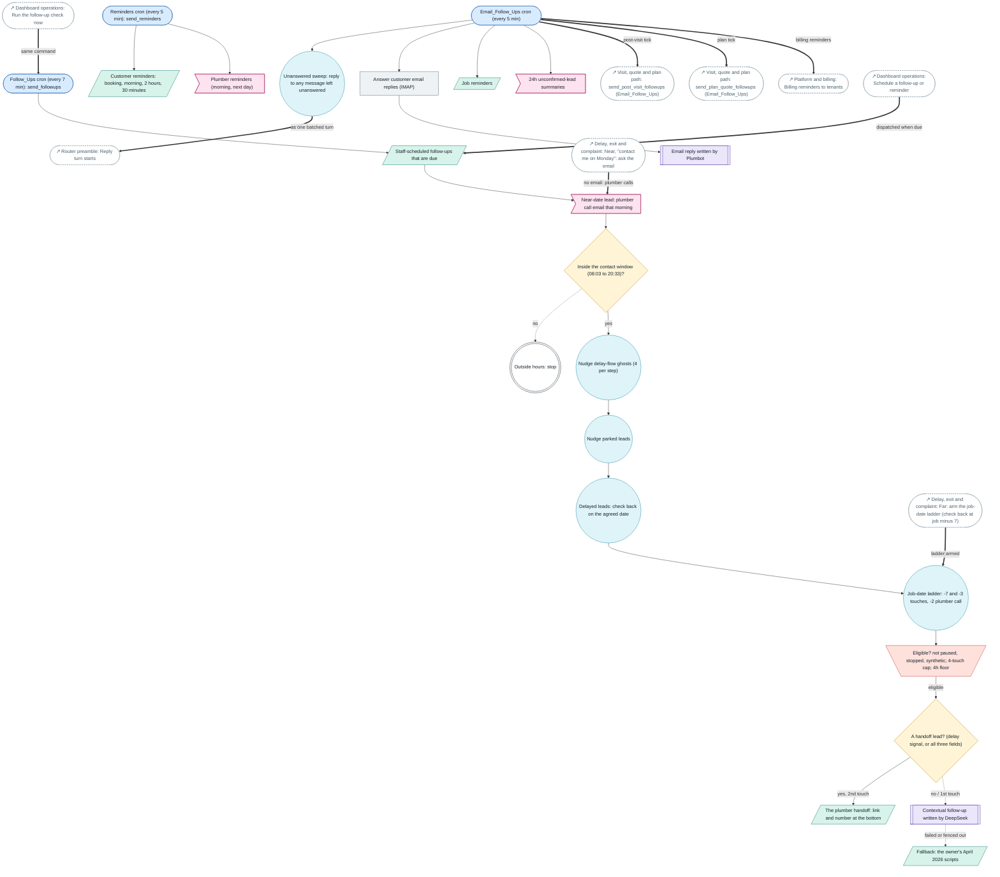

| Step | Kind | Where in the code | Wording |
|---|---|---|---|
| **Follow_Ups cron (every 7 min): send_followups** `f_cron` | Trigger | [`send_followups.py`](../../bot/management/commands/send_followups.py) `handle` [`cron_health.py`](../../bot/cron_health.py) `beat` | - |
| **Staff-scheduled follow-ups that are due** `f_sched` | WhatsApp message | [`send_scheduled_followups.py`](../../bot/management/commands/send_scheduled_followups.py) `dispatch_due_scheduled_followups` | - |
| **Near-date lead: plumber call email that morning** `f_near` | Internal alert | [`near_date_call.py`](../../bot/near_date_call.py) `run_tick` [`near_date_call.py`](../../bot/near_date_call.py) `build_brief` | - |
| **Inside the contact window (08:03 to 20:33)?** `f_window` | If (code) | [`send_followups.py`](../../bot/management/commands/send_followups.py) `_in_contact_window` | - |
| **Outside hours: stop** `f_out` | End | - | - |
| **Nudge delay-flow ghosts (4 per step)** `f_ghost` | Loop / cron job | [`send_followups.py`](../../bot/management/commands/send_followups.py) `_nudge_delay_flow_ghosts` | 12 line(s) in `_DELAY_NUDGE_MESSAGES` |
| **Nudge parked leads** `f_parked` | Loop / cron job | [`send_followups.py`](../../bot/management/commands/send_followups.py) `_nudge_parked_leads` | 1 line(s) in `_nudge_parked_leads` |
| **Delayed leads: check back on the agreed date** `f_react` | Loop / cron job | [`send_followups.py`](../../bot/management/commands/send_followups.py) `_process_delayed_reactivations` | 8 line(s) in `_process_delayed_reactivations` |
| **Job-date ladder: -7 and -3 touches, -2 plumber call** `f_ladder` | Loop / cron job | [`send_followups.py`](../../bot/management/commands/send_followups.py) `_process_job_date_ladder` [`job_date_ladder.py`](../../bot/job_date_ladder.py) `touch_message` [`job_date_ladder.py`](../../bot/job_date_ladder.py) `touch_email` [`job_date_ladder.py`](../../bot/job_date_ladder.py) `send_call_brief` | 3 line(s) in `touch_message`, `LADDER_EMAIL_FIRST`, `LADDER_EMAIL_SECOND`, `LADDER_GET_QUOTE_BUTTON` |
| **Eligible? not paused, stopped, synthetic; 4-touch cap; 4h floor** `f_elig` | Override gate | [`send_followups.py`](../../bot/management/commands/send_followups.py) `_get_eligible_leads` [`send_followups.py`](../../bot/management/commands/send_followups.py) `_is_ready_for_followup` [`send_followups.py`](../../bot/management/commands/send_followups.py) `touches_since_last_reply` [`send_followups.py`](../../bot/management/commands/send_followups.py) `_exclude_suppressed_states` | - |
| **A handoff lead? (delay signal, or all three fields)** `f_handoff_q` | If (code) | [`send_followups.py`](../../bot/management/commands/send_followups.py) `handoff_eligible` [`send_followups.py`](../../bot/management/commands/send_followups.py) `handoff_sent_since_last_reply` | - |
| **The plumber handoff: link and number at the bottom** `f_handoff` | WhatsApp message | [`send_followups.py`](../../bot/management/commands/send_followups.py) `_handoff_touch` [`plumber_link.py`](../../bot/plumber_link.py) `handoff_message` | `HANDOFF_LEAVE_IT_HERE`, `HANDOFF_WHO_HANDLES_QUOTES`, `HANDOFF_QUOTES_HERE`, `HANDOFF_NUMBER_OF`, `HANDOFF_NUMBER`, `WHENEVER_YOURE_READY`, `HANDOFF_NUMBER_OF_SN`, `HANDOFF_NUMBER_SN` |
| **Contextual follow-up written by DeepSeek** `f_ai` | Model writes | [`send_followups.py`](../../bot/management/commands/send_followups.py) `_ai_message` | 16 line(s) in `_ai_message` |
| **Fallback: the owner's April 2026 scripts** `f_template` | WhatsApp message | [`send_followups.py`](../../bot/management/commands/send_followups.py) `_template_message` | 29 line(s) in `_template_message` |
| **Email_Follow_Ups cron (every 5 min)** `f_email_cron` | Trigger | [`send_scheduled_followups.py`](../../bot/management/commands/send_scheduled_followups.py) `handle` | - |
| **Unanswered sweep: reply to any message left unanswered** `f_sweep` | Loop / cron job | [`unanswered_sweep.py`](../../bot/unanswered_sweep.py) `answer_unanswered` [`unanswered_sweep.py`](../../bot/unanswered_sweep.py) `unanswered_leads` | - |
| **Answer customer email replies (IMAP)** `f_inbound_email` | Step | [`process_inbound_emails.py`](../../bot/management/commands/process_inbound_emails.py) `handle` | - |
| **Email reply written by Plumbot** `f_email_reply` | Model writes | [`process_inbound_emails.py`](../../bot/management/commands/process_inbound_emails.py) `_generate_plumbot_email_reply` | 1 line(s) in `_build_acknowledgement_reply` |
| **Job reminders** `f_jobrem` | WhatsApp message | [`send_job_reminders.py`](../../bot/management/commands/send_job_reminders.py) `handle` [`send_job_reminders.py`](../../bot/management/commands/send_job_reminders.py) `send_job_reminder` | 7 line(s) in `send_job_reminder` |
| **24h unconfirmed-lead summaries** `f_summary` | Internal alert | [`summarize_unconfirmed_leads.py`](../../bot/management/commands/summarize_unconfirmed_leads.py) `handle` | - |
| **Reminders cron (every 5 min): send_reminders** `f_rem` | Trigger | [`send_reminders.py`](../../bot/management/commands/send_reminders.py) `handle` | - |
| **Customer reminders: booking, morning, 2 hours, 30 minutes** `f_rem_send` | WhatsApp message | [`send_reminders.py`](../../bot/management/commands/send_reminders.py) `_deliver_customer_reminder` | 1 line(s) in `_msg_2days`, 1 line(s) in `_msg_1day`, 1 line(s) in `_msg_morning`, 1 line(s) in `_msg_2hours` |
| **Plumber reminders (morning, next day)** `f_rem_plumber` | Internal alert | [`send_reminders.py`](../../bot/management/commands/send_reminders.py) `_msg_plumber_morning` [`send_reminders.py`](../../bot/management/commands/send_reminders.py) `_msg_plumber_next_day` [`send_reminders.py`](../../bot/management/commands/send_reminders.py) `_msg_plumber_2hours` | - |

### Visit, quote and plan path

After the visit: the debrief form, quotes and their follow-up sequence; the plan path; future-dated visit proposals; phone quotes.

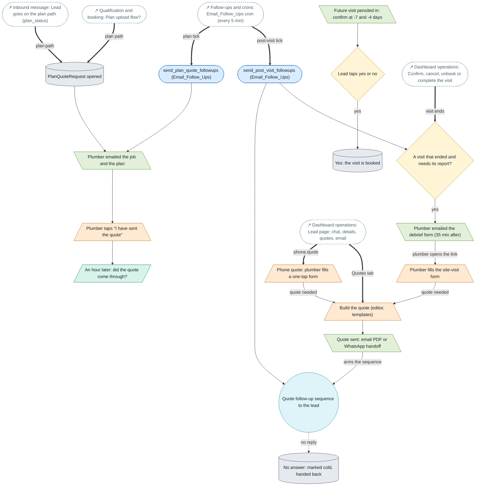

| Step | Kind | Where in the code | Wording |
|---|---|---|---|
| **send_post_visit_followups (Email_Follow_Ups)** `pv_tick` | Trigger | [`send_post_visit_followups.py`](../../bot/management/commands/send_post_visit_followups.py) `handle` [`post_visit.py`](../../bot/post_visit.py) `run_post_visit_tick` | - |
| **A visit that ended and needs its report?** `pv_due` | If (code) | [`post_visit.py`](../../bot/post_visit.py) `due_visits` [`post_visit.py`](../../bot/post_visit.py) `is_due_for_report` [`post_visit.py`](../../bot/post_visit.py) `too_stale_to_open` | - |
| **Plumber emailed the debrief form (35 min after)** `pv_report` | Email / PDF | [`post_visit.py`](../../bot/post_visit.py) `_tick_open_report` [`post_visit.py`](../../bot/post_visit.py) `form_url` | - |
| **Plumber fills the site-visit form** `pv_form` | Staff action | [`post_visit.py`](../../bot/views/post_visit.py) `site_visit_form` [`post_visit.py`](../../bot/post_visit.py) `apply_submission` | - |
| **Build the quote (editor, templates)** `pv_quote` | Staff action | [`quotations.py`](../../bot/views/quotations.py) `CreateQuotationView` [`quotations.py`](../../bot/views/quotations.py) `EditQuotationView` | - |
| **Quote sent: email PDF or WhatsApp handoff** `pv_quote_send` | Email / PDF | [`quotations.py`](../../bot/views/quotations.py) `send_quotation` [`quotations.py`](../../bot/views/quotations.py) `quotation_whatsapp_handoff` [`post_visit.py`](../../bot/views/post_visit.py) `send_quotation_email` [`quotations.py`](../../bot/views/quotations.py) `mark_quotation_sent` | - |
| **Quote follow-up sequence to the lead** `pv_seq` | Loop / cron job | [`post_visit.py`](../../bot/post_visit.py) `_tick_sequence` [`post_visit.py`](../../bot/post_visit.py) `_send_ask` [`post_visit.py`](../../bot/post_visit.py) `_send_confirmation` [`post_visit.py`](../../bot/post_visit.py) `start_quote_followups` | 3 line(s) in `_send_ask`, 5 line(s) in `_send_confirmation` |
| **No answer: marked cold, handed back** `pv_cold` | State | [`post_visit.py`](../../bot/post_visit.py) `_mark_cold` | - |
| **PlanQuoteRequest opened** `pv_plan_req` | State | [`plan_quote.py`](../../bot/plan_quote.py) `ensure_request` | - |
| **send_plan_quote_followups (Email_Follow_Ups)** `pv_plan_tick` | Trigger | [`send_plan_quote_followups.py`](../../bot/management/commands/send_plan_quote_followups.py) `handle` [`plan_quote.py`](../../bot/plan_quote.py) `run_plan_quote_tick` | - |
| **Plumber emailed the job and the plan** `pv_plan_email` | Email / PDF | [`plan_quote.py`](../../bot/plan_quote.py) `_tick_one` | - |
| **Plumber taps "I have sent the quote"** `pv_plan_form` | Staff action | [`plan_quote.py`](../../bot/views/plan_quote.py) `plan_quote_form` [`plan_quote.py`](../../bot/plan_quote.py) `apply_plumber_form` | - |
| **An hour later: did the quote come through?** `pv_plan_check` | WhatsApp message | [`plan_quote.py`](../../bot/plan_quote.py) `_send_quote_check` | `PLAN_QUOTE_CHECK` |
| **Future visit penciled in: confirm at -7 and -4 days** `pv_proposal` | Email / PDF | [`visit_proposal.py`](../../bot/visit_proposal.py) `run_visit_proposal_tick` [`visit_proposal.py`](../../bot/visit_proposal.py) `_send_lead_checkin` [`visit_proposal.py`](../../bot/visit_proposal.py) `_send_plumber_checkin` | 2 line(s) in `_send_lead_checkin`, 2 line(s) in `_send_plumber_checkin` |
| **Lead taps yes or no** `pv_proposal_ans` | If (code) | [`visit_proposal.py`](../../bot/views/visit_proposal.py) `visit_proposal_answer` [`visit_proposal.py`](../../bot/visit_proposal.py) `apply_lead_answer` | - |
| **Yes: the visit is booked** `pv_book` | State | [`visit_proposal.py`](../../bot/visit_proposal.py) `_book_the_visit` | - |
| **Phone quote: plumber fills a one-tap form** `pv_phone` | Staff action | [`phone_quote.py`](../../bot/views/phone_quote.py) `phone_quote_start` [`phone_quote.py`](../../bot/views/phone_quote.py) `phone_quote_form` | - |

### Dashboard operations

What staff do on the dashboard and how each action feeds the automated flow.

```mermaid
flowchart TD
  op_dash[/"Dashboard: diary and the day at a glance"\]
  class op_dash k_staff
  op_inbox[/"Lead inbox (date window, search)"\]
  class op_inbox k_staff
  op_detail[/"Lead page: chat, details, quotes, email"\]
  class op_detail k_staff
  op_pause[/"Pause or resume the bot"\]
  class op_pause k_staff
  op_intercept[/"Intercept the bot reply in flight"\]
  class op_intercept k_staff
  op_manual[/"Send a manual WhatsApp or follow-up"\]
  class op_manual k_staff
  op_pdf[/"Send the portfolio PDF, a PDF or an image"\]
  class op_pdf k_staff
  op_handoff[/"Send the plumber handoff"\]
  class op_handoff k_staff
  op_edit[/"Edit details, date and time"\]
  class op_edit k_staff
  op_confirm[/"Confirm, cancel, unbook or complete the visit"\]
  class op_confirm k_staff
  op_schedule[/"Schedule a follow-up or reminder"\]
  class op_schedule k_staff
  op_inactive[/"Mark inactive / stop follow-ups"\]
  class op_inactive k_staff
  op_run_check[/"Run the follow-up check now"\]
  class op_run_check k_staff
  op_jobs[/"Schedule a job, update its status"\]
  class op_jobs k_staff
  op_calendar[/"Calendar"\]
  class op_calendar k_staff
  op_gallery[/"Gallery: upload past-work photos"\]
  class op_gallery k_staff
  op_offer[/"Offer and prices"\]
  class op_offer k_staff
  op_settings[/"Settings: calendar, AI, email health"\]
  class op_settings k_staff
  op_inbox --> op_detail
  op_dash --> op_detail
  op_detail --> op_pause
  op_detail --> op_intercept
  op_detail --> op_manual
  op_detail --> op_pdf
  op_detail --> op_handoff
  op_detail --> op_edit
  op_detail --> op_confirm
  op_detail --> op_schedule
  op_detail --> op_inactive
  op_detail --> op_jobs
  ro_paused(["↗ Router preamble: Bot paused for this lead?"])
  class ro_paused ext
  op_pause ==>|"chatbot_paused"| ro_paused
  ob_cancel(["↗ Outbound chain: A newer message arrived during the wait?"])
  class ob_cancel ext
  op_intercept ==>|"cancels the pending send"| ob_cancel
  f_sched(["↗ Follow-ups and crons: Staff-scheduled follow-ups that are due"])
  class f_sched ext
  op_schedule ==>|"dispatched when due"| f_sched
  f_cron(["↗ Follow-ups and crons: Follow_Ups cron (every 7 min): send_followups"])
  class f_cron ext
  op_run_check ==>|"same command"| f_cron
  pv_due(["↗ Visit, quote and plan path: A visit that ended and needs its report?"])
  class pv_due ext
  op_confirm ==>|"visit ends"| pv_due
  pv_quote(["↗ Visit, quote and plan path: Build the quote (editor, templates)"])
  class pv_quote ext
  op_detail ==>|"Quotes tab"| pv_quote
  pv_phone(["↗ Visit, quote and plan path: Phone quote: plumber fills a one-tap form"])
  class pv_phone ext
  op_detail ==>|"phone quote"| pv_phone
  ro_proof(["↗ Router preamble: Proof step: 2 or 3 matched past jobs, then the next question"])
  class ro_proof ext
  op_gallery ==>|"photos used"| ro_proof
  classDef k_trigger fill:#d9ecff,stroke:#2f6fb3,color:#14212b
  classDef k_step fill:#eef2f4,stroke:#5b6f7a,color:#14212b
  classDef k_decision fill:#fff4d6,stroke:#b8860b,color:#14212b
  classDef k_ai_decision fill:#f0e4ff,stroke:#7b4bc4,color:#14212b
  classDef k_gate fill:#ffe1dc,stroke:#c0392b,color:#14212b
  classDef k_send fill:#d8f3ea,stroke:#0b7a75,color:#14212b
  classDef k_email fill:#e2f0d9,stroke:#4d8a2c,color:#14212b
  classDef k_ai_write fill:#ece6fb,stroke:#5e45a8,color:#14212b
  classDef k_data fill:#e6e9ee,stroke:#46545f,color:#14212b
  classDef k_staff fill:#ffe9d1,stroke:#c26a17,color:#14212b
  classDef k_notify fill:#fde2ef,stroke:#b03a74,color:#14212b
  classDef k_loop fill:#dff4f8,stroke:#1f8aa0,color:#14212b
  classDef k_wait fill:#f4f0e6,stroke:#8c7a4f,color:#14212b
  classDef k_end fill:#ffffff,stroke:#14212b,color:#14212b
  classDef ext fill:#ffffff,stroke:#8aa0ab,stroke-dasharray:4 3,color:#46606c
```

| Step | Kind | Where in the code | Wording |
|---|---|---|---|
| **Dashboard: diary and the day at a glance** `op_dash` | Staff action | [`dashboard.py`](../../bot/views/dashboard.py) `DashboardView` | - |
| **Lead inbox (date window, search)** `op_inbox` | Staff action | [`appointments.py`](../../bot/views/appointments.py) `ConversationsView` [`lead_search.py`](../../bot/lead_search.py) `filter_leads` | - |
| **Lead page: chat, details, quotes, email** `op_detail` | Staff action | [`appointments.py`](../../bot/views/appointments.py) `ConversationDetailView` [`appointments.py`](../../bot/views/appointments.py) `conversation_live` | - |
| **Pause or resume the bot** `op_pause` | Staff action | [`followups.py`](../../bot/views/followups.py) `pause_chatbot` [`followups.py`](../../bot/views/followups.py) `resume_chatbot` | - |
| **Intercept the bot reply in flight** `op_intercept` | Staff action | [`appointments.py`](../../bot/views/appointments.py) `intercept_bot_reply` [`whatsapp_webhook.py`](../../bot/whatsapp_webhook.py) `request_intercept` | - |
| **Send a manual WhatsApp or follow-up** `op_manual` | Staff action | [`followups.py`](../../bot/views/followups.py) `send_followup` | - |
| **Send the portfolio PDF, a PDF or an image** `op_pdf` | Staff action | [`followups.py`](../../bot/views/followups.py) `send_portfolio_pdf_to_lead` [`followups.py`](../../bot/views/followups.py) `send_pdf_to_lead` [`followups.py`](../../bot/views/followups.py) `send_image_to_lead` | - |
| **Send the plumber handoff** `op_handoff` | Staff action | [`followups.py`](../../bot/views/followups.py) `send_plumber_handoff_to_lead` | - |
| **Edit details, date and time** `op_edit` | Staff action | [`appointments.py`](../../bot/views/appointments.py) `update_appointment` | - |
| **Confirm, cancel, unbook or complete the visit** `op_confirm` | Staff action | [`appointments.py`](../../bot/views/appointments.py) `confirm_appointment` [`appointments.py`](../../bot/views/appointments.py) `cancel_appointment` [`appointments.py`](../../bot/views/appointments.py) `unbook_appointment` [`appointments.py`](../../bot/views/appointments.py) `complete_lead_appointment` | - |
| **Schedule a follow-up or reminder** `op_schedule` | Staff action | [`followups.py`](../../bot/views/followups.py) `schedule_followup` [`followups.py`](../../bot/views/followups.py) `schedule_reminder` | - |
| **Mark inactive / stop follow-ups** `op_inactive` | Staff action | [`followups.py`](../../bot/views/followups.py) `mark_lead_inactive` | - |
| **Run the follow-up check now** `op_run_check` | Staff action | [`followups.py`](../../bot/views/followups.py) `manual_followup_check` | - |
| **Schedule a job, update its status** `op_jobs` | Staff action | [`jobs.py`](../../bot/views/jobs.py) `schedule_job` [`jobs.py`](../../bot/views/jobs.py) `update_job_status` | - |
| **Calendar** `op_calendar` | Staff action | [`calendar_views.py`](../../bot/views/calendar_views.py) `CalendarView` | - |
| **Gallery: upload past-work photos** `op_gallery` | Staff action | [`gallery.py`](../../bot/views/gallery.py) `gallery_upload` | - |
| **Offer and prices** `op_offer` | Staff action | [`offer.py`](../../bot/views/offer.py) `offer_save` | - |
| **Settings: calendar, AI, email health** `op_settings` | Staff action | [`settings_views.py`](../../bot/views/settings_views.py) `settings_view` [`settings_views.py`](../../bot/views/settings_views.py) `email_settings_view` | - |

### Platform and billing

The operator side: tenants, their config and lead magnet, client intake, invoices, payments and billing reminders.

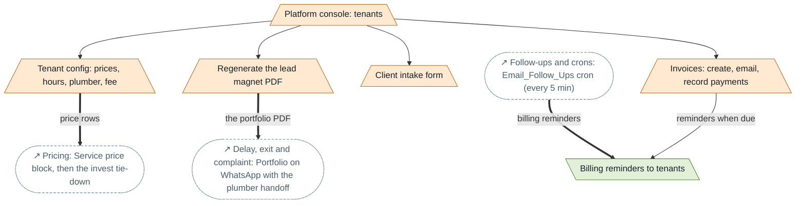

| Step | Kind | Where in the code | Wording |
|---|---|---|---|
| **Platform console: tenants** `pl_console` | Staff action | [`platform.py`](../../bot/views/platform.py) `platform_console` [`platform.py`](../../bot/views/platform.py) `platform_create_tenant` | - |
| **Tenant config: prices, hours, plumber, fee** `pl_config` | Staff action | [`platform.py`](../../bot/views/platform.py) `platform_tenant_config_edit` [`tenant_config.py`](../../bot/tenant_config.py) `get_config` | - |
| **Regenerate the lead magnet PDF** `pl_magnet` | Staff action | [`platform.py`](../../bot/views/platform.py) `platform_tenant_lead_magnet_regenerate` [`lead_magnet.py`](../../bot/lead_magnet.py) `build_lead_magnet_pdf` | - |
| **Client intake form** `pl_intake` | Staff action | [`platform.py`](../../bot/views/platform.py) `intake_form` [`platform.py`](../../bot/views/platform.py) `platform_review_intake` | - |
| **Invoices: create, email, record payments** `pl_invoice` | Staff action | [`billing.py`](../../bot/views/billing.py) `billing_invoice_new` [`billing.py`](../../bot/views/billing.py) `billing_invoice_email` [`billing.py`](../../bot/views/billing.py) `billing_payment_add` | - |
| **Billing reminders to tenants** `pl_billrem` | Email / PDF | [`billing_reminders.py`](../../bot/billing_reminders.py) `run_billing_reminders` | - |
